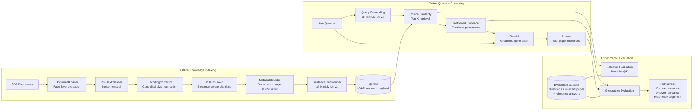
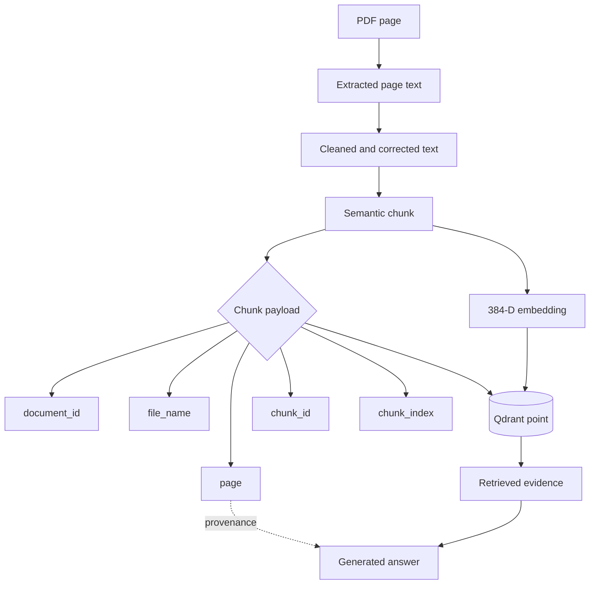
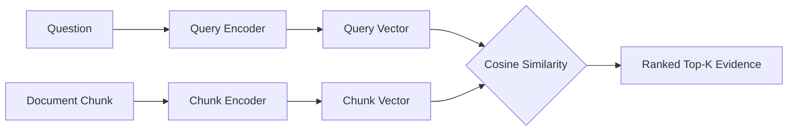

# Multimodal GenAI Decision Support

## Evidence-Grounded Decision Support for Digital Transformation and AI Governance

<p align="center">
<strong>PDF ingestion · Semantic retrieval · Retrieval-Augmented Generation · Provenance · Evaluation</strong>
</p>

---

## Abstract

This repository contains a research prototype for **evidence-grounded generative AI decision support** applied to digital transformation and AI governance. The prototype investigates how knowledge contained in unstructured PDF documents can be transformed into retrievable semantic representations and used to generate answers that remain traceable to their documentary evidence.

The current implementation is deliberately **PDF-only**. It establishes a controlled baseline for a broader multimodal research direction; native table understanding, visual embeddings, OCR, and image-level reasoning are not yet implemented.

The experimental system separates four functions: **document processing**, **semantic retrieval**, **evidence-grounded generation**, and **evaluation**. This separation is central to the research design because retrieval errors and generation errors must be observable independently.

---

## 1. Research Problem

Organizations accumulate strategic, regulatory, technical, and managerial documents, but access to this knowledge remains difficult when information is distributed across long unstructured files. A generative model can produce fluent responses without demonstrating that its claims are supported by the organization's documents.

This project studies the following research question:

> **How can Retrieval-Augmented Generation transform organizational PDF collections into traceable and evidence-grounded decision support for digital transformation and AI governance?**

The prototype operationalizes this question through three requirements:

- **retrievability** — relevant evidence must be identifiable from the document collection;
- **grounding** — generated claims must be constrained by retrieved evidence;
- **provenance** — evidence must remain traceable to its source document and page.

---

## 2. Scope

### Implemented baseline

The current system implements:

- PDF text extraction at page level;
- conservative text cleaning and encoding correction;
- sentence-aware chunking with page preservation;
- chunk-level provenance metadata;
- dense semantic embeddings with `all-MiniLM-L6-v2`;
- vector storage and cosine-similarity retrieval with Qdrant;
- top-k evidence retrieval;
- document-grounded answer generation with Gemini;
- retrieval evaluation using Precision@K;
- LLM-based assessment of faithfulness, context relevance, answer relevance, and reference alignment.

### Outside the current baseline

The current version does **not** implement native table reasoning, figure/image embeddings, dedicated OCR, audio/video processing, hybrid retrieval, reranking, enterprise authentication, or production-scale deployment. These are research extensions rather than existing capabilities.

---

## 3. System Architecture

### 3.1 End-to-End RAG Architecture



The architecture contains two operational paths. **Offline indexing** converts source documents into persistent vector representations. **Online inference** embeds a user question, retrieves evidence from the same vector space, and supplies that evidence to the generator. Evaluation is kept outside the operational path so that experimental metrics do not alter retrieval or generation behavior.

### 3.2 Information and Provenance Flow



Provenance is therefore not reconstructed after generation. It is attached to each retrieval unit before indexing and propagated with the retrieved evidence.

---

## 4. Processing and Retrieval Method

### 4.1 PDF extraction and cleaning

`DocumentLoader` extracts text page by page and preserves document metadata. `PDFTextCleaner` removes recurrent boundary noise such as repeated headers and footers while retaining semantic content. `EncodingCorrector` applies explicit word-level corrections to known PDF glyph corruption; it intentionally avoids broad substitutions that could alter valid text.

### 4.2 Chunk construction

`PDFChunker` operates page by page and uses sentence-aware segmentation. The baseline configuration is:

| Parameter | Value |
|---|---:|
| Target chunk size | 1000 characters |
| Overlap | 200 characters |
| Boundary strategy | Sentence-aware |
| Cross-page chunks | No |

This design favors traceability: each chunk remains associated with one source page. The trade-off is that semantic units spanning page boundaries are not represented as a single chunk.

### 4.3 Metadata model

Each retrieval unit contains both text and provenance metadata:

```json
{
  "chunk_id": "chunk_0107",
  "document_id": "...",
  "file_name": "document.pdf",
  "file_type": "pdf",
  "page": 36,
  "chunk_index": 107,
  "text": "..."
}
```

### 4.4 Semantic representation and retrieval

The baseline embedding model is `sentence-transformers/all-MiniLM-L6-v2`, producing **384-dimensional dense vectors**. The same model encodes document chunks and user queries. Qdrant stores the vectors and associated payloads, and retrieval uses **cosine similarity**. The current experiment retrieves **K = 5** chunks per question.



### 4.5 Evidence-grounded generation

Retrieved chunks are supplied to Gemini together with the user question. The generation prompt requires the model to use only the supplied context, avoid unsupported claims, acknowledge insufficient evidence, and cite relevant page numbers. This is a grounding constraint, not a guarantee of factual correctness; faithfulness is evaluated separately.

---

## 5. Evaluation Design

### 5.1 Evaluation dataset

`data/evaluation/rag_questions.json` currently contains **10 evaluation questions** covering AI governance, organizational readiness, AI risks, transparency, training, cultural change, and responsible adoption. Each item contains a question, manually identified relevant pages, and a reference answer.

```json
{
  "id": "q001",
  "question": "...",
  "relevant_pages": [16, 35, 36],
  "reference_answer": "..."
}
```

The dataset is an initial experimental benchmark, not a statistically representative corpus.

### 5.2 Retrieval evaluation

The implemented retrieval metric is **Precision@K**:

\[
\mathrm{Precision@K} = \frac{\text{relevant items among the top K retrieved items}}{K}
\]

In the current implementation, relevance is approximated using manually annotated **page identifiers**. This operationalization has an important limitation: a semantically useful chunk can be counted as non-relevant if its page was not included in the manually specified relevant-page set. Consequently, page-based Precision@K should be interpreted as a baseline retrieval signal rather than a complete measure of semantic relevance.

Planned retrieval metrics include Recall@K, Hit Rate@K, and Mean Reciprocal Rank (MRR).

### 5.3 Generation evaluation

A separate Gemini-based evaluator scores four dimensions on a 0–1 scale:

| Dimension | Operational question |
|---|---|
| Faithfulness | Are generated claims supported by retrieved evidence? |
| Context relevance | Is the retrieved evidence relevant to the question? |
| Answer relevance | Does the answer address the question directly? |
| Reference alignment | Does the answer cover information represented in the reference answer? |

These scores are **LLM-based judgments**, not human-validated ground truth. They should therefore be treated as experimental indicators and, in later work, compared with human assessment.

### 5.4 Evaluation architecture

```mermaid
flowchart LR
    DATA[(Evaluation Item)] --> Q[Question]
    DATA --> RP[Relevant Pages]
    DATA --> REF[Reference Answer]

    Q --> RET[Retriever]
    RET --> TOP[Top-K Chunks]
    TOP --> P[Precision@K]
    RP --> P

    Q --> LLM[Generator]
    TOP --> LLM
    LLM --> A[Generated Answer]

    Q --> J[LLM Evaluator]
    TOP --> J
    A --> J
    REF --> J
    J --> SCORES[Four Evaluation Scores]
```

This design intentionally evaluates retrieval and generation separately. A strong generated answer cannot, by itself, establish that retrieval quality is strong, and a strong retrieval result does not guarantee a faithful answer.

---

## 6. Initial Experimental Result

For evaluation question `q001`, the manually annotated relevant pages were **16, 35, and 36**. The first five retrieved chunks originated from pages **19, 28, 36, 28, and 12**, resulting in **Precision@5 = 0.20** under the page-based relevance definition.

The generated answer was subsequently scored by the LLM evaluator as follows:

| Metric | Score |
|---|---:|
| Faithfulness | 1.00 |
| Context relevance | 1.00 |
| Answer relevance | 1.00 |
| Reference alignment | 0.90 |

This single observation does **not** establish overall system performance. It instead exposes a methodological issue: the manually defined page set and the LLM's semantic assessment of retrieved evidence can produce different relevance signals. A larger evaluation is required before drawing comparative or general conclusions.

The planned ten-question generation evaluation could not be completed in one run because the Gemini Free Tier request quota was reached. This is an experimental infrastructure constraint; incomplete results are not reported as a completed benchmark.

---

## 7. Reproducibility

The main experimental variables are explicit and should be recorded for each run:

| Component | Baseline configuration |
|---|---|
| Input modality | PDF text |
| Chunk size | 1000 characters |
| Chunk overlap | 200 characters |
| Embedding model | `all-MiniLM-L6-v2` |
| Embedding dimension | 384 |
| Vector database | Qdrant |
| Similarity | Cosine |
| Retrieval depth | Top-5 |
| Generation model | Gemini |
| Retrieval metric | Precision@5 |
| Generation evaluation | Gemini-based four-dimension evaluator |

Future experiments should version the document corpus, evaluation dataset, model identifiers, prompts, and configuration values so that changes in performance can be attributed to controlled modifications rather than undocumented pipeline drift.

---

## 8. Repository Structure

```text
multimodal-genai-decision-support/
├── data/
│   ├── raw/                 # local source PDFs; excluded from Git
│   ├── processed/           # local processed artifacts; excluded from Git
│   ├── metadata/
│   └── evaluation/
│       └── rag_questions.json
├── notebooks/
├── src/
│   ├── ingestion/
│   │   └── document_loader.py
│   ├── cleaning/
│   │   ├── pdf_cleaner.py
│   │   └── encoding_corrector.py
│   ├── chunking/
│   │   └── pdf_chunker.py
│   ├── metadata/
│   │   └── metadata_builder.py
│   ├── embeddings/
│   │   └── embedding_model.py
│   ├── retrieval/
│   │   └── qdrant_store.py
│   ├── generation/
│   │   └── llm_generator.py
│   └── evaluation/
│       ├── retrieval_evaluator.py
│       └── llm_evaluator.py
├── tests/
│   └── test_rag.py
├── config/
├── docs/
├── .env.example
├── requirements.txt
├── docker-compose.yml
└── README.md
```

---

## 9. Technology Stack

| Layer | Technology |
|---|---|
| Language | Python 3.11 |
| PDF extraction | pypdf |
| PDF processing dependency | PyMuPDF |
| Embeddings | Sentence Transformers |
| Baseline embedding model | `all-MiniLM-L6-v2` |
| Vector database | Qdrant |
| Similarity metric | Cosine similarity |
| Generation | Google Gemini |
| Containerization | Docker / Docker Compose |
| Environment configuration | python-dotenv |
| Evaluation | Python + Gemini |

---

## 10. Installation and Execution

### Prerequisites

Python 3.11, Docker, Docker Compose, Git, and a Gemini API key are required.

### Clone and configure

```bash
git clone https://github.com/soumailaniampa11/multimodal-genai-decision-support.git
cd multimodal-genai-decision-support
python3.11 -m venv .venv
source .venv/bin/activate
pip install --upgrade pip
pip install -r requirements.txt
cp .env.example .env
```

Set the API key in `.env`:

```env
GEMINI_API_KEY=your_api_key_here
```

`.env` must not be committed to version control.

### Start Qdrant

```bash
docker compose up -d
docker ps
```

The baseline collection is `ai_governance_documents`, configured for 384-dimensional vectors and cosine distance.

### Run the experimental pipeline

```bash
python -m tests.test_rag
```

---

## 11. Limitations and Threats to Validity

The current prototype should be interpreted as an experimental baseline. Its principal limitations are:

1. **Corpus scope** — the current implementation and initial experiment use PDF textual content only.
2. **Extraction dependency** — downstream quality depends on the fidelity of PDF text extraction.
3. **Page-level relevance labels** — manually selected pages provide coarse relevance judgments and can underestimate semantically useful retrievals.
4. **Single embedding baseline** — no controlled embedding-model comparison has yet been conducted.
5. **Dense retrieval only** — lexical retrieval, hybrid search, and reranking are not yet implemented.
6. **Small evaluation set** — ten questions are sufficient for pipeline validation but not for statistically robust claims.
7. **LLM-as-judge evaluation** — generation scores may inherit evaluator-model biases and require human validation.
8. **API quota dependency** — generation experiments are currently constrained by external model quotas.

---

## 12. Research Roadmap

The next experiments should prioritize methodological improvements rather than additional interface features:

- implement Recall@K, Hit Rate@K, and MRR;
- refine relevance annotation from page-level labels toward chunk- or passage-level judgments;
- compare dense retrieval configurations and embedding models;
- introduce lexical/hybrid retrieval and reranking as controlled ablations;
- add response caching and experiment logging;
- compare LLM-based evaluation with human judgments;
- extend PDF understanding to tables, figures, layout, OCR, and visual representations only after the textual baseline is stable.

The broader multimodal direction should therefore be treated as a **research progression from a validated textual baseline**, not as an already implemented capability.

---

## 13. Scientific Positioning

The project lies at the intersection of **Retrieval-Augmented Generation**, **Information Retrieval**, **Data Engineering**, **Knowledge Management**, **Decision Support Systems**, **Digital Transformation**, and **AI Governance**.

Its primary research contribution at the current stage is not a new retrieval algorithm or foundation model. It is a **modular experimental framework** for studying how organizational documentary evidence can be processed, retrieved, propagated with provenance, used to constrain generative answers, and evaluated at distinct stages of the RAG pipeline.

This positioning makes the prototype suitable for subsequent experiments on trustworthy and traceable GenAI decision support, while keeping claims aligned with what has actually been implemented and measured.

---

## 14. Repository Status

**Status: Research prototype / experimental baseline**

Implemented: PDF ingestion and extraction, cleaning, encoding correction, sentence-aware chunking, provenance metadata, dense embeddings, Qdrant storage, semantic retrieval, Gemini-based grounded generation, a 10-question evaluation dataset, Precision@K, and LLM-based generation evaluation.

Planned: additional retrieval metrics, improved relevance annotations, retrieval ablations, embedding comparisons, hybrid retrieval, reranking, larger evaluation sets, human evaluation, and multimodal PDF understanding.

---

## 15. License

This repository is currently intended for research and educational use. A specific open-source license should be selected before broader redistribution or reuse.
