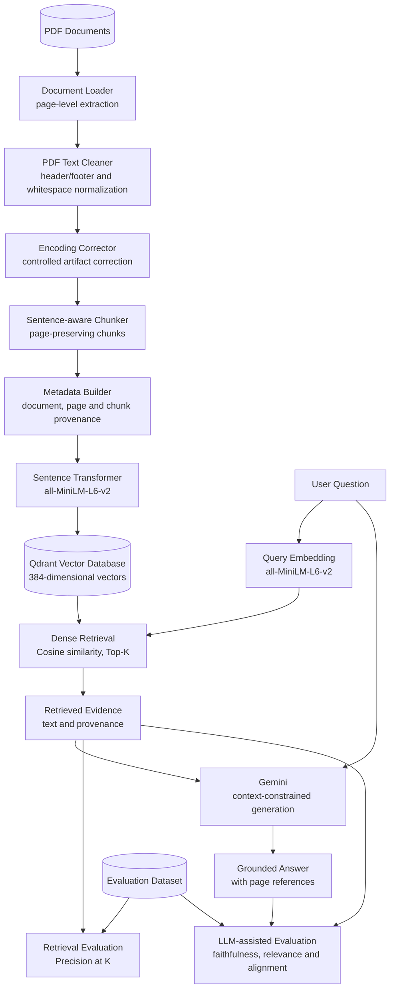
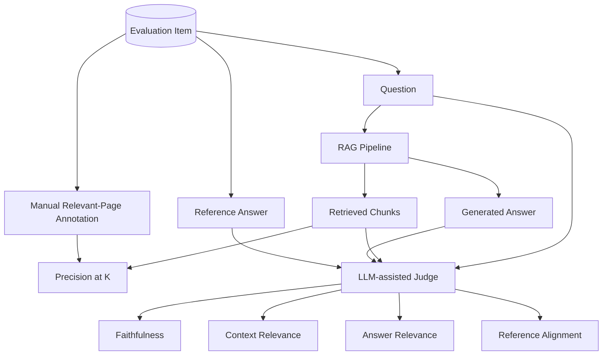

# Multimodal GenAI Decision Support

## Evidence-Grounded Decision Support for Digital Transformation and AI Governance

<p align="center">
<strong>PDF ingestion · sentence-aware chunking · dense retrieval · RAG · provenance · experimental evaluation</strong>
</p>

---

## Abstract

This repository contains a research prototype for **evidence-grounded decision support with Retrieval-Augmented Generation (RAG)** in the context of digital transformation and AI governance.

The prototype studies how textual knowledge extracted from organizational PDF documents can be transformed into retrievable representations and used as explicit evidence for large-language-model generation. The current system implements a controlled PDF-based baseline comprising document ingestion, text normalization, sentence-aware chunking, metadata construction, dense vector representation, similarity retrieval, evidence-grounded generation, and experimental evaluation.

The research emphasis is not on building a generic chatbot. It is on separating and observing the principal components of a RAG system so that retrieval quality, generation quality, provenance, and failure modes can be studied independently.

> **Current implementation boundary:** despite the repository name, the implemented baseline is **not yet multimodal in the machine-learning sense**. It currently processes extracted PDF text. Tables, figures, layout, OCR, and visual embeddings remain research extensions.

---

## 1. Research Problem

Organizations increasingly rely on strategic, regulatory, technical, and managerial documents when making decisions about digital transformation and AI. Conventional generative models can produce fluent responses, but fluency alone does not establish that an answer is supported by organizational evidence.

This prototype therefore focuses on three related requirements:

- **retrievability** — relevant passages should be identifiable from a document collection;
- **grounding** — generated claims should be constrained by retrieved evidence;
- **traceability** — evidence should retain document- and page-level provenance.

### Research question

> **How can Retrieval-Augmented Generation transform organizational PDF knowledge into traceable, evidence-grounded decision support for digital transformation and AI governance?**

The current implementation provides an experimental baseline for investigating this question rather than claiming to resolve it conclusively.

---

## 2. Research Scope

### Implemented baseline

The current system supports:

- PDF text extraction;
- page-level provenance;
- conservative PDF text cleaning;
- correction of known encoding artifacts;
- sentence-aware, page-preserving chunking;
- chunk-level metadata;
- dense text embeddings;
- cosine-similarity retrieval in Qdrant;
- top-*K* evidence retrieval;
- Gemini-based answer generation constrained to retrieved context;
- page-based retrieval evaluation;
- LLM-assisted answer evaluation.

### Outside the current implementation

The following capabilities are **not currently implemented**:

- OCR as a dedicated ingestion path;
- native table extraction and reasoning;
- figure or image understanding;
- document-layout modeling;
- visual or multimodal embeddings;
- audio/video processing;
- hybrid lexical–dense retrieval;
- reranking;
- production authentication, observability, or enterprise deployment.

The term *multimodal* therefore refers to the intended research trajectory, not to the capabilities of the present baseline.

---

## 3. System Architecture

The architecture separates **offline knowledge indexing**, **online retrieval and generation**, and **experimental evaluation**. This separation is important because poor answers may originate from retrieval errors, generation errors, limitations in the reference annotations, or interactions among these components.



### Architectural principle

The system deliberately uses the **same embedding model** for document chunks and user queries, placing both in the same 384-dimensional representation space. Qdrant then performs nearest-neighbor retrieval using cosine similarity. Retrieved chunks and their provenance form the evidence supplied to Gemini.

Evaluation is kept outside the operational answer path: it measures experimental behavior but does not determine the answer returned by the RAG pipeline.

---

## 4. Repository Structure

```text
multimodal-genai-decision-support/
├── data/
│   ├── raw/                    # local PDFs; excluded from Git
│   ├── processed/              # local derived artifacts; excluded from Git
│   ├── metadata/
│   └── evaluation/
│       └── rag_questions.json
├── notebooks/
├── src/
│   ├── ingestion/
│   │   └── document_loader.py
│   ├── cleaning/
│   │   ├── pdf_cleaner.py
│   │   └── encoding_corrector.py
│   ├── chunking/
│   │   └── pdf_chunker.py
│   ├── metadata/
│   │   └── metadata_builder.py
│   ├── embeddings/
│   │   └── embedding_model.py
│   ├── retrieval/
│   │   └── qdrant_store.py
│   ├── generation/
│   │   └── llm_generator.py
│   └── evaluation/
│       ├── retrieval_evaluator.py
│       └── llm_evaluator.py
├── tests/
│   └── test_rag.py
├── config/
├── docs/
├── .env.example
├── .gitignore
├── requirements.txt
├── docker-compose.yml
└── README.md
```

---

## 5. Technology Stack

| Component | Current implementation |
|---|---|
| Language | Python 3.11 |
| PDF extraction | `pypdf` |
| Additional PDF dependency | `PyMuPDF` |
| Embeddings | `sentence-transformers` |
| Embedding model | `all-MiniLM-L6-v2` |
| Embedding dimension | 384 |
| Vector database | Qdrant |
| Similarity metric | Cosine similarity |
| Generation model | Google Gemini |
| Configuration | `python-dotenv` |
| Containerization | Docker / Docker Compose |
| Evaluation | Python + Gemini-assisted evaluator |

`PyMuPDF` is currently included as a project dependency, while the implemented `DocumentLoader` baseline performs PDF text extraction with `pypdf`.

---

## 6. Methodology

### 6.1 PDF ingestion and page representation

`DocumentLoader` extracts PDF text page by page and preserves document metadata where available. The internal representation contains the filename, file type, title, author, subject, page count, page number, and extracted page text.

Page preservation is methodologically important because page identifiers are subsequently propagated into chunks and retrieval results, providing the current provenance mechanism.

### 6.2 Conservative text cleaning

Raw PDF extraction may contain repeated headers and footers, irregular spacing, and line-level artifacts. `PDFTextCleaner` detects repeated boundary lines across pages using a configurable repetition threshold and removes them while normalizing whitespace.

The cleaning strategy is intentionally conservative: the objective is to reduce extraction noise without performing broad transformations that could modify document meaning.

### 6.3 Encoding-artifact correction

Some PDFs expose glyph-to-Unicode mapping errors during text extraction. `encoding_corrector.py` applies explicit word-level replacements for corruption patterns observed in the experimental corpus.

This component should be interpreted as **corpus-specific normalization**, not as a general encoding-repair algorithm. Controlled mappings reduce the risk of altering valid punctuation or legitimate character sequences.

### 6.4 Sentence-aware chunking

The current chunker operates page by page and attempts to preserve paragraph and sentence boundaries. Its baseline configuration is:

| Parameter | Value |
|---|---:|
| Target chunk size | 1000 characters |
| Overlap | 200 characters |

The method is better described as **sentence-aware chunking** than *semantic chunking*: boundaries are informed by textual structure rather than by an embedding-based semantic segmentation algorithm.

Each chunk retains its source page, preventing a chunk from losing the primary provenance unit used by the current evaluation framework.

### 6.5 Metadata and provenance

Each retrieval unit is enriched with structured metadata:

```json
{
  "chunk_id": "chunk_0107",
  "document_id": "...",
  "file_name": "document.pdf",
  "file_type": "pdf",
  "page": 36,
  "chunk_index": 107,
  "text": "..."
}
```

The metadata supports both retrieval payloads and evidence traceability. Current provenance is document/page/chunk based; section-level or bounding-box provenance is not yet implemented.

### 6.6 Dense representation

Text chunks are encoded with `all-MiniLM-L6-v2` using Sentence Transformers. Each chunk is represented by a 384-dimensional dense vector.

The query is encoded by the same model. Retrieval therefore compares query and chunk representations within a common embedding space.

### 6.7 Vector retrieval

Qdrant stores the chunk vectors together with their metadata payloads. The current retrieval configuration uses cosine similarity and returns the top five results:

\[
K = 5
\]

The current implementation is a **dense-retrieval baseline**. It does not yet combine lexical retrieval, metadata filtering, cross-encoder reranking, or query expansion.

### 6.8 Evidence-grounded generation

For each question, retrieved chunks are serialized into an explicit context containing document, page, chunk identifier, and text. Gemini receives both the question and this retrieved context.

The generation prompt instructs the model to:

- answer only from the supplied evidence;
- avoid unsupported external information;
- state when the available context is insufficient;
- cite relevant page numbers;
- produce a concise answer.

This is a **prompt-level grounding constraint**. It reduces the opportunity for unsupported generation but does not, by itself, guarantee factual faithfulness.

---

## 7. Experimental Evaluation Framework

Evaluation is separated into retrieval-level and answer-level analysis.



### 7.1 Evaluation dataset

`data/evaluation/rag_questions.json` currently contains **10 manually specified evaluation questions** covering topics including AI adoption, organizational readiness, risk, governance, cultural change, data/privacy/IP, skills, transparency, and responsible adoption.

Each item contains:

```json
{
  "id": "q001",
  "question": "...",
  "relevant_pages": [16, 35, 36],
  "reference_answer": "..."
}
```

The `relevant_pages` field should be treated as a **manual reference annotation**, not as exhaustive semantic ground truth. A passage outside the annotated page set may still be relevant to a question.

### 7.2 Retrieval metric

The implemented retrieval metric is Precision@K:

\[
\mathrm{Precision@K} = \frac{\text{number of retrieved items judged relevant}}{K}
\]

In the current code, relevance is operationalized by whether a retrieved chunk originates from a page listed in `relevant_pages`. Consequently, the metric measures agreement with the page annotations rather than passage-level semantic relevance directly.

Planned retrieval metrics include:

- Recall@K;
- Hit Rate@K;
- Mean Reciprocal Rank (MRR).

A stronger future protocol should also introduce passage-level relevance judgments and, where feasible, graded relevance.

### 7.3 LLM-assisted answer evaluation

The current evaluator uses Gemini to assign scores in \([0,1]\) for four dimensions:

| Dimension | Operational question |
|---|---|
| Faithfulness | Are answer claims supported by the retrieved context? |
| Context relevance | Is the retrieved context useful for the question? |
| Answer relevance | Does the answer address the question? |
| Reference alignment | Does the answer cover information represented in the reference answer? |

These values are **LLM-judge outputs**, not validated psychometric or statistical measurements. They should therefore be interpreted as experimental indicators. Human evaluation, repeated judging, inter-rater analysis, or comparison with independent evaluation methods would be required before treating them as robust quality estimates.

---

## 8. Preliminary Experiment

A preliminary run was completed for evaluation item `q001`.

**Question theme:** obstacles to AI adoption and associated recommendations.

The manually annotated reference pages were **16, 35, and 36**. The five retrieved chunks originated from pages **19, 28, 36, 28, and 12**, yielding:

\[
\mathrm{Precision@5} = 0.20
\]

The generated answer was then assessed by the current Gemini-based evaluator:

| Experimental indicator | Score |
|---|---:|
| Faithfulness | 1.000 |
| Context relevance | 1.000 |
| Answer relevance | 1.000 |
| Reference alignment | 0.900 |

### Interpretation

This single observation illustrates a methodological issue rather than establishing system performance. The page-based retrieval metric penalized retrieved evidence from pages not included in the manual annotation, while the LLM judge considered the retrieved context and answer highly relevant.

Several explanations remain possible:

1. the dense retriever returned useful evidence outside the annotated page set;
2. the page-level annotations were incomplete;
3. the LLM judge was overly permissive;
4. the metrics capture different properties of the system.

Accordingly, **no general performance conclusion should be drawn from this single evaluation item**. The observation instead motivates more precise relevance annotation and a multi-metric evaluation protocol.

---

## 9. Experimental Constraint: Gemini API Quota

The complete 10-question LLM-assisted evaluation has not yet been completed. During the experiment, the configured Gemini Free Tier reached its request quota after the first questions.

This constraint does not indicate a retrieval or RAG implementation failure, but it limits the completeness and reproducibility of the current LLM-based evaluation.

Potential experimental controls include:

- caching generated answers and evaluation outputs;
- separating retrieval-only experiments from generation experiments;
- avoiding repeated LLM calls for unchanged inputs;
- using an evaluation model with sufficient quota;
- recording model/version and evaluation configuration for every run.

The repository should not report aggregate 10-question LLM results until a complete run has actually been obtained.

---

## 10. Reproducibility

A reproducible RAG experiment should record at least the following variables:

| Experimental component | Current baseline |
|---|---|
| Input modality | Extracted PDF text |
| Cleaning | Repeated-boundary removal + whitespace normalization |
| Encoding repair | Explicit corpus-specific mappings |
| Chunking | Sentence-aware, page-preserving |
| Chunk target size | 1000 characters |
| Chunk overlap | 200 characters |
| Embedding model | `all-MiniLM-L6-v2` |
| Vector dimension | 384 |
| Vector store | Qdrant |
| Similarity | Cosine |
| Retrieval depth | Top-5 |
| Generation | Gemini |
| Retrieval evaluation | Page-based Precision@5 |
| Answer evaluation | Gemini-assisted four-dimension judge |
| Evaluation set | 10 questions |

Future experiments should additionally persist model versions, random or deterministic settings where applicable, timestamps, corpus versions, prompts, and raw evaluation outputs.

---

## 11. Installation and Execution

### Prerequisites

- Python 3.11;
- Docker and Docker Compose;
- Git;
- a Gemini API key.

### Clone the repository

```bash
git clone https://github.com/soumailaniampa11/multimodal-genai-decision-support.git
cd multimodal-genai-decision-support
```

### Create and activate the environment

```bash
python3.11 -m venv .venv
source .venv/bin/activate
python --version
```

### Install dependencies

```bash
pip install --upgrade pip
pip install -r requirements.txt
```

### Configure Gemini

```bash
cp .env.example .env
```

Add the API key to `.env`:

```env
GEMINI_API_KEY=your_api_key_here
```

`.env` is excluded from version control and must not be committed.

### Start Qdrant

```bash
docker compose up -d
docker ps
```

Current vector-store configuration:

| Setting | Value |
|---|---|
| HTTP port | `6333` |
| Collection | `ai_governance_documents` |
| Vector dimension | `384` |
| Distance | Cosine |

### Run the experimental RAG test

```bash
python -m tests.test_rag
```

The current test performs retrieval, answer generation, retrieval evaluation, LLM-assisted evaluation, and aggregation where API quota permits.

---

## 12. Research Roadmap

The next research iterations should prioritize methodological improvements before expanding system complexity.

### Retrieval

- add Recall@K, Hit Rate@K, and MRR;
- move from page-only to passage-level relevance annotations;
- compare embedding models under the same benchmark;
- evaluate lexical and hybrid retrieval;
- introduce reranking and measure its incremental effect.

### Evaluation

- enlarge the benchmark beyond 10 questions;
- distinguish retrieval relevance from answer correctness more rigorously;
- introduce human judgments for a subset of the benchmark;
- evaluate agreement between human and LLM judges;
- perform ablation studies on cleaning, chunking, embedding, and retrieval configuration;
- report aggregate results only after complete experimental runs.

### Provenance and generation

- add section-level provenance where document structure permits;
- introduce structured citations;
- test explicit abstention when evidence is insufficient;
- investigate contradiction detection and evidence coverage.

### Multimodal PDF understanding

After the textual baseline is sufficiently evaluated, the broader research direction can extend to:

- tables;
- figures and diagrams;
- OCR for scanned pages;
- document layout;
- visual embeddings;
- cross-modal retrieval and evidence fusion.

This ordering preserves a measurable textual baseline against which multimodal extensions can later be compared.

---

## 13. Scientific Positioning

The project sits at the intersection of:

- Retrieval-Augmented Generation;
- Information Retrieval;
- Generative AI;
- document processing;
- data engineering;
- knowledge management;
- decision support systems;
- digital transformation;
- AI governance.

Its principal scientific interest is the **traceable transformation of organizational documents into retrieved evidence and evidence-constrained generated answers**, together with explicit evaluation of the retrieval and generation stages.

The prototype should therefore be understood as an **experimental RAG system for decision-support research**, not as evidence that RAG alone produces trustworthy organizational decisions. Trustworthiness requires stronger evaluation, broader evidence, human oversight, and governance mechanisms beyond the current implementation.

---

## 14. Limitations

The current baseline has several important limitations.

1. **Text-only PDF processing.** The system does not yet exploit visual or layout information contained in PDFs.
2. **Extraction dependence.** Downstream performance depends on the quality of PDF text extraction.
3. **Corpus-specific encoding correction.** Known-glyph mappings may not generalize to other document collections.
4. **Single embedding model.** No controlled embedding-model comparison has yet been completed.
5. **Dense retrieval only.** Lexical retrieval, hybrid retrieval, and reranking are not implemented.
6. **Page-level relevance annotations.** The current retrieval labels may omit semantically relevant passages on other pages.
7. **Small evaluation set.** Ten questions support prototype testing but not statistically robust conclusions.
8. **LLM-as-judge dependence.** The evaluator has not yet been validated against systematic human judgments.
9. **Incomplete full-run evaluation.** API quota prevented completion of the planned 10-question LLM-assisted experiment.
10. **No decision-outcome evaluation.** The prototype evaluates retrieval and generated answers, not the quality of real organizational decisions made from those answers.

---

## 15. Repository Status

**Status: research prototype / experimental baseline**

| Capability | Status |
|---|:---:|
| PDF text ingestion | Implemented |
| Page-level provenance | Implemented |
| PDF cleaning | Implemented |
| Controlled encoding correction | Implemented |
| Sentence-aware chunking | Implemented |
| Metadata construction | Implemented |
| Dense embeddings | Implemented |
| Qdrant vector storage | Implemented |
| Dense semantic retrieval | Implemented |
| Gemini evidence-grounded generation | Implemented |
| 10-question evaluation dataset | Implemented |
| Precision@K | Implemented |
| LLM-assisted evaluation | Implemented, quota-constrained |
| Recall@K / Hit Rate@K / MRR | Planned |
| Passage-level relevance judgments | Planned |
| Hybrid retrieval | Planned |
| Reranking | Planned |
| Human evaluation | Planned |
| Multimodal PDF understanding | Planned |

---

## 16. Conclusion

This repository establishes a modular baseline for studying evidence-grounded RAG over organizational PDF documents. Its current contribution is the explicit separation of document preparation, dense retrieval, provenance-preserving evidence construction, constrained generation, and experimental evaluation.

The preliminary results are intentionally treated as observations rather than performance claims. The next stage of the project is to strengthen the evaluation protocol and retrieval baseline before introducing more advanced retrieval strategies or multimodal PDF understanding.

This progression provides a controlled foundation for investigating how traceable GenAI systems may support digital-transformation and AI-governance analysis while preserving a clear distinction between **retrieved evidence**, **generated synthesis**, and **decision-making responsibility**.

---

## 17. License

This repository is currently intended for research and educational use. A specific open-source license should be selected before broader redistribution or reuse terms are asserted.
