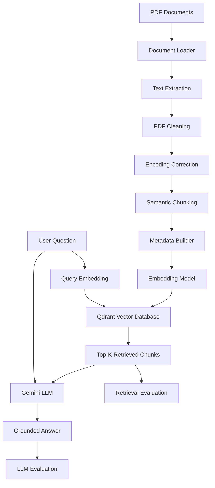

# Multimodal GenAI Decision Support
## A Research Prototype for Evidence-Grounded AI Decision Support in Digital Transformation and AI Governance

<p align="center">

**PDF Ingestion · Semantic Retrieval · RAG · Source Traceability · AI Governance**

</p>

---

## Abstract

This repository presents a research-oriented prototype for **Generative AI-based decision support** applied to digital transformation and AI governance.

The system investigates how organizational knowledge contained in unstructured PDF documents can be transformed into a searchable semantic representation and subsequently used to generate **evidence-grounded answers**.

The architecture follows a modular Retrieval-Augmented Generation (RAG) pipeline:

```text
PDF Documents
     │
     ▼
Document Ingestion
     │
     ▼
Text Extraction
     │
     ▼
PDF Cleaning & Encoding Correction
     │
     ▼
Semantic Chunking
     │
     ▼
Metadata Construction
     │
     ▼
Sentence Embeddings
     │
     ▼
Qdrant Vector Database
     │
     ▼
Semantic Retrieval
     │
     ▼
Retrieved Evidence
     │
     ▼
Gemini Generation
     │
     ▼
Grounded Answer
     │
     ▼
Evaluation
```

The current implementation focuses exclusively on **PDF documents**. The project is therefore a research prototype for a broader multimodal decision-support direction rather than a complete multimodal production system.

---

# 1. Research Motivation

Organizations increasingly accumulate large volumes of strategic, regulatory, technical and managerial documentation.

The difficulty is not only storing this information, but also:

- locating relevant evidence;
- preserving document context;
- identifying the provenance of information;
- transforming retrieved evidence into useful answers;
- controlling unsupported or hallucinated model outputs;
- evaluating the quality of both retrieval and generation.

A conventional generative AI system can produce fluent answers without guaranteeing that those answers are grounded in an organization's source material.

This project therefore investigates the following principle:

> **Generative AI should operate on explicitly retrieved evidence rather than relying exclusively on the model's internal knowledge.**

The resulting architecture separates the problem into four major stages:

1. **Knowledge ingestion**
2. **Semantic retrieval**
3. **Evidence-grounded generation**
4. **System evaluation**

This separation also makes it possible to experimentally study where errors originate.

---

# 2. Research Question

The prototype is designed around a general research question:

> **How can Retrieval-Augmented Generation be used to transform organizational document collections into traceable and evidence-grounded decision support for digital transformation and AI governance?**

The system is not intended merely to demonstrate a chatbot interface.

Its purpose is to provide an experimental framework in which the following can be studied independently:

- document preprocessing;
- semantic representation;
- information retrieval;
- evidence grounding;
- generative response quality;
- evaluation methodology.

---

# 3. Research Scope

### Current scope

The current experimental pipeline processes:

- PDF documents;
- extracted textual content;
- page-level metadata;
- semantic chunks;
- dense vector embeddings;
- vector similarity retrieval;
- LLM-based generation.

### Current non-scope

The current version does not yet implement:

- image understanding outside extracted PDF text;
- OCR as a dedicated pipeline;
- native table understanding;
- figure/image embeddings;
- video or audio processing;
- production-grade authentication;
- enterprise-scale deployment.

The term **multimodal** describes the broader research direction. The present experimental implementation deliberately starts with PDF documents in order to establish a controlled and reproducible baseline.

---

# 4. System Architecture

## 4.1 End-to-End Architecture



The architecture explicitly separates **retrieval** from **generation**.

This is important experimentally because an incorrect answer can result from:

- inadequate retrieval;
- inadequate generation;
- or both.

---

# 5. Project Structure

```text
multimodal-genai-decision-support/
│
├── data/
│   ├── raw/
│   ├── processed/
│   ├── metadata/
│   └── evaluation/
│       └── rag_questions.json
│
├── notebooks/
│
├── src/
│   ├── ingestion/
│   │   └── document_loader.py
│   │
│   ├── cleaning/
│   │   ├── pdf_cleaner.py
│   │   └── encoding_corrector.py
│   │
│   ├── chunking/
│   │   └── pdf_chunker.py
│   │
│   ├── metadata/
│   │   └── metadata_builder.py
│   │
│   ├── embeddings/
│   │   └── embedding_model.py
│   │
│   ├── retrieval/
│   │   └── qdrant_store.py
│   │
│   ├── generation/
│   │   └── llm_generator.py
│   │
│   └── evaluation/
│       ├── retrieval_evaluator.py
│       └── llm_evaluator.py
│
├── tests/
│   └── test_rag.py
│
├── config/
├── docs/
│
├── .env.example
├── requirements.txt
├── docker-compose.yml
└── README.md
```

---

# 6. Technology Stack

| Layer | Technology |
|---|---|
| Language | Python 3.11 |
| PDF extraction | pypdf |
| PDF processing | PyMuPDF |
| Embeddings | Sentence Transformers |
| Embedding model | `all-MiniLM-L6-v2` |
| Vector database | Qdrant |
| Vector metric | Cosine similarity |
| LLM | Google Gemini |
| Containers | Docker / Docker Compose |
| Configuration | python-dotenv |
| Evaluation | Python + Gemini |

The current embedding model produces **384-dimensional vectors**.

---

# 7. Installation

## 7.1 Prerequisites

Install:

- Python 3.11;
- Docker;
- Docker Compose;
- Git;
- a Gemini API key.

The project was developed and tested on macOS.

---

## 7.2 Clone the Repository

```bash
git clone https://github.com/<USERNAME>/multimodal-genai-decision-support.git
cd multimodal-genai-decision-support
```

---

## 7.3 Create the Virtual Environment

```bash
python3.11 -m venv .venv
```

Activate it:

```bash
source .venv/bin/activate
```

Verify:

```bash
python --version
```

Expected:

```text
Python 3.11.x
```

---

## 7.4 Install Dependencies

```bash
pip install --upgrade pip
pip install -r requirements.txt
```

The main dependencies are:

```text
pypdf
PyMuPDF
python-dotenv
sentence-transformers
qdrant-client
google-genai
```

---

# 8. Environment Configuration

Create the environment file:

```bash
cp .env.example .env
```

Configure the Gemini API key:

```env
GEMINI_API_KEY=your_api_key_here
```

Never commit `.env` to Git.

A corresponding `.env.example` should contain only placeholders.

---

# 9. Start Qdrant

Qdrant provides the vector storage layer.

Start the service:

```bash
docker compose up -d
```

Check the running containers:

```bash
docker ps
```

The Qdrant service uses:

```text
HTTP API: 6333
```

The application uses the collection:

```text
ai_governance_documents
```

with:

```text
Vector dimension: 384
Distance metric: cosine
```

---

# 10. Data Pipeline

## 10.1 Document Ingestion

The `DocumentLoader` reads PDF files and extracts their textual content page by page.

The extracted representation preserves:

- filename;
- file type;
- title;
- author;
- subject;
- number of pages;
- page number;
- page text.

Conceptually:

```text
PDF
 │
 ├── Page 1 → text
 ├── Page 2 → text
 ├── ...
 └── Page N → text
```

Page-level representation is important because it provides the first level of source traceability.

---

# 11. PDF Cleaning

Raw PDF extraction frequently introduces noise.

The cleaning component addresses:

- repeated headers;
- repeated footers;
- unnecessary whitespace;
- line normalization;
- page-boundary artifacts.

Repeated boundary lines are detected statistically across pages and removed when they exceed the configured repetition threshold.

The objective is not aggressive normalization.

The objective is to remove structural noise while preserving semantic content.

---

# 12. Encoding Correction

PDF text extraction can produce corrupted glyphs because the internal character mapping of a PDF does not always correspond cleanly to Unicode.

The project therefore implements controlled corrections for known extraction artifacts.

The correction process uses explicit word-level mappings.

This is deliberately conservative:

```text
Extracted text
      │
      ▼
Known corruption patterns
      │
      ▼
Controlled replacements
      │
      ▼
Normalized text
```

This avoids broad replacement rules that could unintentionally alter valid content.

---

# 13. Semantic Chunking

Large documents must be divided into smaller units before semantic retrieval.

The current chunker is sentence-aware and operates page by page.

Current parameters:

| Parameter | Value |
|---|---:|
| Target chunk size | 1000 |
| Overlap | 200 |

The chunking process attempts to:

- preserve paragraph boundaries;
- preserve sentence boundaries;
- maintain contextual continuity;
- avoid cutting words;
- preserve page references.

The result is a collection of semantically meaningful retrieval units.

---

# 14. Metadata and Provenance

Each chunk receives structured metadata.

Example:

```json
{
  "chunk_id": "chunk_0107",
  "document_id": "...",
  "file_name": "document.pdf",
  "file_type": "pdf",
  "page": 36,
  "chunk_index": 107,
  "text": "..."
}
```

This metadata serves two purposes:

1. retrieval filtering and organization;
2. provenance and source traceability.

The system can therefore associate generated information with the document and page from which the evidence was retrieved.

---

# 15. Embedding Model

The project uses:

```text
sentence-transformers
```

with:

```text
all-MiniLM-L6-v2
```

Each text chunk is transformed into a 384-dimensional semantic vector.

```text
Text
 │
 ▼
all-MiniLM-L6-v2
 │
 ▼
[384-dimensional vector]
```

The same embedding model is used for:

- document chunks;
- user queries.

This allows the query and document representations to be compared in the same vector space.

---

# 16. Vector Storage and Retrieval

Qdrant stores:

- embeddings;
- chunk identifiers;
- document identifiers;
- page numbers;
- original text;
- additional metadata.

For a query:

```text
User Question
      │
      ▼
Query Embedding
      │
      ▼
Cosine Similarity
      │
      ▼
Top-K Chunks
```

The current experimental configuration uses:

```text
K = 5
```

---

# 17. Retrieval-Augmented Generation

The retrieved chunks are passed to Gemini as explicit document context.

The generation component instructs the model to:

1. use only the supplied context;
2. avoid external knowledge;
3. avoid unsupported claims;
4. acknowledge insufficient evidence;
5. cite relevant page numbers.

The resulting process is:

```text
Question
   +
Retrieved Evidence
   │
   ▼
Gemini
   │
   ▼
Grounded Answer
```

The design is intended to reduce unsupported generation by constraining the model to retrieved evidence.

---

# 18. Evaluation Dataset

The evaluation dataset is stored in:

```text
data/evaluation/rag_questions.json
```

Each evaluation item contains:

```json
{
  "id": "q001",
  "question": "...",
  "relevant_pages": [16, 35, 36],
  "reference_answer": "..."
}
```

The current dataset contains **10 questions** focused on AI governance, organizational readiness, AI risks, transparency, training, cultural change and responsible adoption.

The dataset provides explicit ground-truth information for the experimental evaluation.

---

# 19. Retrieval Evaluation

The initial retrieval evaluator implements:

### Precision@K

For a given query:

```text
Precision@K =
relevant retrieved results / K
```

The current experiment uses:

```text
K = 5
```

Additional metrics planned for the retrieval evaluation are:

- Recall@K;
- Hit Rate@K;
- Mean Reciprocal Rank (MRR).

These metrics are important because Precision@K alone does not fully characterize retrieval quality.

---

# 20. LLM Evaluation

The project implements an LLM-based evaluator using Gemini.

The evaluator considers:

### 20.1 Faithfulness

Are the claims in the generated answer supported by the retrieved evidence?

### 20.2 Context Relevance

Is the retrieved evidence relevant to the question?

### 20.3 Answer Relevance

Does the generated answer directly address the question?

### 20.4 Reference Alignment

Does the generated answer cover the important information contained in the reference answer?

Each metric is scored between:

```text
0.0 and 1.0
```

The evaluator also produces a textual justification.

---

# 21. Experimental Test

The complete test can be launched with:

```bash
python -m tests.test_rag
```

The current test pipeline performs:

```text
1. Load evaluation questions
2. Generate query embeddings
3. Retrieve top-K chunks
4. Evaluate retrieval
5. Generate grounded answers
6. Evaluate generated answers
7. Aggregate results
```

---

# 22. Initial Experimental Observation

A first experiment was conducted on question `q001`.

The system retrieved:

```text
Rank 1 → Page 19
Rank 2 → Page 28
Rank 3 → Page 36
Rank 4 → Page 28
Rank 5 → Page 12
```

The manually defined relevant pages were:

```text
[16, 35, 36]
```

The resulting:

```text
Precision@5 = 0.200
```

The generated answer was subsequently evaluated with the LLM evaluator.

The observed scores were:

| Metric | Score |
|---|---:|
| Faithfulness | 1.000 |
| Context Relevance | 1.000 |
| Answer Relevance | 1.000 |
| Reference Alignment | 0.900 |

These observations demonstrate that retrieval evaluation and answer evaluation can produce different signals.

In particular, page-based Precision@5 should not be interpreted as a complete measure of semantic retrieval quality.

A retrieved page may contain useful evidence without being included in a manually specified ground-truth page set.

---

# 23. Experimental Limitation: API Quota

During the ten-question experiment, the Gemini Free Tier request limit was reached.

The error was:

```text
Rate limit exceeded for model gemini-3.8-flash
limit: 20 requests per day on Free Tier
```

Consequently, the complete ten-question LLM evaluation could not be completed in a single run.

This is an infrastructure constraint rather than a failure of the RAG architecture.

For reproducible experimentation, future runs should consider:

- higher API quotas;
- response caching;
- fewer LLM evaluation calls;
- separate retrieval and generation experiments;
- alternative evaluation models.

The repository should therefore not claim a complete ten-question LLM evaluation until that experiment has actually been completed.

---

# 24. Reproducibility Protocol

A reproducible experiment should record:

```text
Document collection
       ↓
Preprocessing configuration
       ↓
Chunk size and overlap
       ↓
Embedding model
       ↓
Vector database configuration
       ↓
Top-K retrieval parameter
       ↓
Generation model
       ↓
Evaluation dataset
       ↓
Evaluation metrics
```

The project keeps these components explicit so that future experiments can compare different configurations.

---

# 25. Research Extensions

## 25.1 Retrieval

Future experiments may compare:

- dense retrieval;
- lexical retrieval;
- hybrid retrieval;
- reranking;
- alternative embedding models.

## 25.2 Document Understanding

The broader multimodal direction may later include:

- PDF figures;
- tables;
- OCR;
- document layout;
- visual embeddings.

## 25.3 Generation

Potential extensions include:

- structured citations;
- evidence highlighting;
- confidence estimation;
- abstention when evidence is insufficient;
- contradiction detection.

## 25.4 Evaluation

Future experiments may include:

- larger benchmark datasets;
- human evaluation;
- ablation studies;
- embedding-model comparison;
- retrieval-configuration comparison;
- generation-model comparison.

---

# 26. Scientific Positioning

The project sits at the intersection of:

- Generative Artificial Intelligence;
- Retrieval-Augmented Generation;
- Information Retrieval;
- Data Engineering;
- Knowledge Management;
- Digital Transformation;
- AI Governance;
- Decision Support Systems.

The broader objective is to study how data and organizational knowledge can be transformed into traceable AI-assisted decision support.

The architecture therefore emphasizes:

```text
Data
  ↓
Knowledge
  ↓
Retrieval
  ↓
Evidence
  ↓
Generation
  ↓
Decision Support
```

with governance and traceability considered throughout the pipeline.

---

# 27. Limitations

The current prototype has several limitations:

1. **PDF-only implementation**  
   The current system does not yet implement complete multimodal processing.

2. **Extraction dependency**  
   Retrieval quality depends on the quality of PDF text extraction.

3. **Page-based ground truth**  
   Relevant pages are manually defined and may not capture every semantically useful passage.

4. **Single embedding baseline**  
   No systematic comparison between embedding models has yet been performed.

5. **Dense retrieval only**  
   Hybrid retrieval and reranking remain future work.

6. **Small evaluation dataset**  
   Ten evaluation questions are appropriate for an initial prototype but are not sufficient for statistically robust conclusions.

7. **LLM evaluation quota**  
   The Gemini Free Tier limits the number of evaluation calls that can be performed per day.

These limitations are part of the experimental status of the project and should be considered when interpreting results.

---

# 28. Repository Status

**Current status: Research Prototype**

Implemented:

- [x] PDF ingestion
- [x] PDF text extraction
- [x] PDF cleaning
- [x] Encoding correction
- [x] Sentence-aware chunking
- [x] Metadata construction
- [x] Sentence embeddings
- [x] Qdrant vector storage
- [x] Semantic retrieval
- [x] Grounded Gemini generation
- [x] Evaluation dataset
- [x] Precision@K
- [x] LLM-based evaluation

Planned:

- [ ] Recall@K
- [ ] Hit Rate@K
- [ ] MRR
- [ ] Retrieval ablation study
- [ ] Embedding-model comparison
- [ ] Hybrid retrieval
- [ ] Reranking
- [ ] Larger evaluation benchmark
- [ ] Multimodal PDF understanding

---

# 29. Conclusion

This repository provides a modular research prototype for evidence-grounded Generative AI decision support.

The architecture establishes a complete pipeline from:

```text
Unstructured PDF Knowledge
          ↓
Structured Text
          ↓
Semantic Representation
          ↓
Vector Retrieval
          ↓
Retrieved Evidence
          ↓
Grounded Generation
          ↓
Evaluation
```

The main research value of the prototype lies in its separation of ingestion, retrieval, generation and evaluation.

This architecture provides a foundation for future experimental work on trustworthy and traceable GenAI systems for digital transformation and AI governance.

---

# 30. License

This repository is intended primarily for research and educational purposes.

A specific open-source license should be added before public distribution according to the intended reuse conditions.
