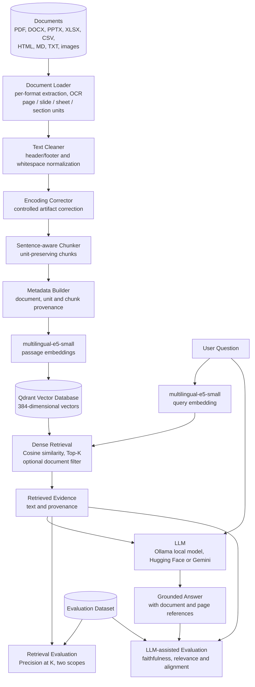
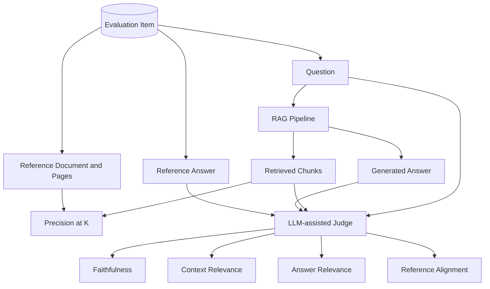

# Multimodal GenAI Decision Support

## Evidence-Grounded Decision Support for Digital Transformation and AI Governance

<p align="center">
<strong>multi-format ingestion · OCR · sentence-aware chunking · multilingual dense retrieval · local LLM · RAG · provenance · experimental evaluation</strong>
</p>

---

## Abstract

This repository contains a research prototype for **evidence-grounded decision support with Retrieval-Augmented Generation (RAG)** in the context of digital transformation and AI governance.

The prototype studies how knowledge contained in organizational documents can be transformed into retrievable representations and used as explicit evidence for large-language-model generation. The current system implements a controlled baseline comprising multi-format document ingestion (PDF, Word, PowerPoint, spreadsheets, HTML, Markdown, text and images through OCR), text normalization, sentence-aware chunking, provenance metadata, multilingual dense vector representation, similarity retrieval, evidence-grounded generation with a locally hosted open-weight model, and experimental evaluation.

The research emphasis is not on building a generic chatbot. It is on separating and observing the principal components of a RAG system so that retrieval quality, generation quality, provenance, and failure modes can be studied independently.

> **Current implementation boundary:** despite the repository name, the system is **not yet multimodal in the machine-learning sense**. Every format is reduced to text: tables are serialized row by row and images or scanned pages are converted with OCR. Figure understanding, layout modeling and visual embeddings remain research extensions.

---

## 1. Research Problem

Organizations increasingly rely on strategic, regulatory, technical, and managerial documents when making decisions about digital transformation and AI. Conventional generative models can produce fluent responses, but fluency alone does not establish that an answer is supported by organizational evidence.

This prototype therefore focuses on three related requirements:

- **retrievability** — relevant passages should be identifiable from a document collection;
- **grounding** — generated claims should be constrained by retrieved evidence;
- **traceability** — evidence should retain document- and page-level provenance.

### Research question

> **How can Retrieval-Augmented Generation transform organizational document knowledge into traceable, evidence-grounded decision support for digital transformation and AI governance?**

The current implementation provides an experimental baseline for investigating this question rather than claiming to resolve it conclusively.

---

## 2. Research Scope

### Implemented baseline

The current system supports:

- ingestion of PDF, DOCX, PPTX, XLSX, CSV, HTML, Markdown, TXT and image files;
- OCR (Tesseract, English and French) for images and scanned PDF pages;
- a common, citable unit per format: page, slide, sheet or section;
- conservative text cleaning and correction of known encoding artifacts;
- sentence-aware, unit-preserving chunking;
- chunk-level provenance metadata;
- multilingual dense embeddings (`intfloat/multilingual-e5-small`);
- cosine-similarity retrieval in Qdrant, optionally restricted to one document;
- answer generation constrained to retrieved context, with a pluggable LLM provider: local open-weight models through Ollama (default), Hugging Face Inference Providers, or Google Gemini;
- document- and page-based retrieval evaluation in two scopes;
- LLM-assisted answer evaluation;
- a central YAML configuration for all experimental parameters.

### Outside the current implementation

The following capabilities are **not currently implemented**:

- figure or image understanding beyond OCR text;
- document-layout modeling and native table reasoning;
- visual or multimodal embeddings;
- audio/video processing;
- legacy binary formats (`.doc`, `.ppt`, `.xls`) and OpenDocument formats;
- hybrid lexical–dense retrieval;
- reranking;
- production authentication, observability, or enterprise deployment.

The term *multimodal* therefore refers to the intended research trajectory, not to the capabilities of the present baseline.

---

## 3. System Architecture

The architecture separates **offline knowledge indexing**, **online retrieval and generation**, and **experimental evaluation**. This separation is important because poor answers may originate from retrieval errors, generation errors, limitations in the reference annotations, or interactions among these components.


```mermaid
flowchart TB

    DOCS[(Documents<br/>PDF, DOCX, PPTX, XLSX, CSV,<br/>HTML, MD, TXT, images)]

    DL[Document Loader<br/>per-format extraction, OCR<br/>page / slide / sheet / section units]
    CL[Text Cleaner<br/>header/footer and whitespace normalization]
    EC[Encoding Corrector<br/>controlled artifact correction]
    CH[Sentence-aware Chunker<br/>unit-preserving chunks]
    MB[Metadata Builder<br/>document, unit and chunk provenance]
    EM[multilingual-e5-small<br/>passage embeddings]
    VS[(Qdrant Vector Database<br/>384-dimensional vectors)]

    DOCS --> DL
    DL --> CL
    CL --> EC
    EC --> CH
    CH --> MB
    MB --> EM
    EM --> VS

    Q[User Question]
    QE[multilingual-e5-small<br/>query embedding]
    RET[Dense Retrieval<br/>Cosine similarity, Top-K<br/>optional document filter]
    EV[Retrieved Evidence<br/>text and provenance]
    LLM[LLM<br/>Ollama local model, Hugging Face or Gemini]
    A[Grounded Answer<br/>with document and page references]

    Q --> QE
    QE --> RET
    VS --> RET
    RET --> EV
    EV --> LLM
    Q --> LLM
    LLM --> A

    DS[(Evaluation Dataset)]
    RE[Retrieval Evaluation<br/>Precision at K, two scopes]
    GE[LLM-assisted Evaluation<br/>faithfulness, relevance and alignment]

    DS --> RE
    DS --> GE
    EV --> RE
    EV --> GE
    A --> GE
```

### Architectural principle

The system uses the **same embedding model** for document chunks and user queries, placing both in the same 384-dimensional representation space. Because the model is multilingual, a French question can be matched with an English passage. Qdrant then performs nearest-neighbor retrieval using cosine similarity. Retrieved chunks and their provenance form the evidence supplied to the language model.

Evaluation is kept outside the operational answer path: it measures experimental behavior but does not determine the answer returned by the RAG pipeline.

---

## 4. Repository Structure

```text
multimodal-genai-decision-support/
├── config/
│   └── config.yaml             # all experimental parameters
├── data/
│   ├── raw/                    # local source documents; excluded from Git
│   ├── processed/              # local derived artifacts; excluded from Git
│   ├── metadata/
│   └── evaluation/
│       └── rag_questions.json
├── notebooks/
├── src/
│   ├── config.py               # YAML configuration loader
│   ├── ingestion/
│   │   └── document_loader.py  # all formats + OCR
│   ├── cleaning/
│   │   ├── pdf_cleaner.py
│   │   └── encoding_corrector.py
│   ├── chunking/
│   │   └── pdf_chunker.py
│   ├── metadata/
│   │   └── metadata_builder.py
│   ├── embeddings/
│   │   └── embedding_model.py
│   ├── retrieval/
│   │   └── qdrant_store.py
│   ├── llm/
│   │   └── llm_client.py       # Ollama, Hugging Face and Gemini clients
│   ├── generation/
│   │   └── llm_generator.py
│   └── evaluation/
│       ├── retrieval_evaluator.py
│       └── llm_evaluator.py
├── tests/
│   ├── test_qdrant.py              # index every document in data/raw
│   ├── test_retrieval_benchmark.py # retrieval-only evaluation, no LLM
│   ├── test_rag.py                 # full RAG evaluation
│   └── ...                         # component scripts
├── docs/
├── .gitignore
├── requirements.txt
├── docker-compose.yml
└── README.md
```

---

## 5. Technology Stack

| Component | Current implementation |
|---|---|
| Language | Python 3.11 |
| PDF extraction | `pypdf`, `PyMuPDF` (page rendering for OCR) |
| Office and web formats | `python-docx`, `python-pptx`, `openpyxl`, `pandas`, `lxml` |
| OCR | Tesseract through `pytesseract` (English + French) |
| Embeddings | `sentence-transformers` |
| Embedding model | `intfloat/multilingual-e5-small` (baseline: `all-MiniLM-L6-v2`) |
| Embedding dimension | 384 |
| Vector database | Qdrant `v1.19.1` |
| Similarity metric | Cosine similarity |
| Generation model | `llama3.2:3b` through Ollama (local, default) |
| Alternative LLM providers | Hugging Face Inference Providers, Google Gemini |
| Configuration | `config/config.yaml` (`PyYAML`), `python-dotenv` for optional API keys |
| Containerization | Docker / Docker Compose (Qdrant) |
| Evaluation | Python + LLM-assisted evaluator |

All Python dependencies are pinned in `requirements.txt`.

---

## 6. Methodology

### 6.1 Multi-format ingestion and citable units

`DocumentLoader` converts every supported format into the same representation: a file name, a file type, a **unit** name, and an ordered list of units with their text. The unit is the provenance granularity that the rest of the pipeline propagates into chunks, retrieval results and citations.

| Format | Extraction | Citable unit |
|---|---|---|
| PDF | `pypdf` text layer; OCR when a page has no text layer | page |
| DOCX | paragraphs and tables in document order | section (new section at each heading) |
| PPTX | text frames, tables and speaker notes | slide |
| XLSX / CSV | one block per sheet | sheet |
| HTML | visible text of headings, paragraphs, lists and tables | page |
| Markdown | split at headings | section |
| TXT | full text | page |
| Images | OCR | page |

Tables are serialized row by row as `header: value | header: value`, so that each cell keeps the meaning given by its column after embedding. This is a textual approximation of tables, not table reasoning.

### 6.2 Conservative text cleaning

Raw extraction may contain repeated headers and footers, irregular spacing, and line-level artifacts. `PDFTextCleaner` detects lines repeated at the boundaries of several pages using a configurable repetition threshold, and removes them while normalizing whitespace.

Header and footer detection is applied only to paginated formats (PDF and PPTX), and a line must appear on at least two units to be considered repeated. This prevents single-unit documents from losing their first and last lines.

The cleaning strategy is intentionally conservative: the objective is to reduce extraction noise without performing broad transformations that could modify document meaning.

### 6.3 Encoding-artifact correction

Some PDFs expose glyph-to-Unicode mapping errors during text extraction. `encoding_corrector.py` applies explicit word-level replacements for corruption patterns observed in the experimental corpus.

This component should be interpreted as **corpus-specific normalization**, not as a general encoding-repair algorithm. Controlled mappings reduce the risk of altering valid punctuation or legitimate character sequences.

### 6.4 Sentence-aware chunking

The chunker operates unit by unit and attempts to preserve paragraph and sentence boundaries. Its baseline configuration is:

| Parameter | Value |
|---|---:|
| Target chunk size | 1000 characters |
| Overlap | 200 characters |

The method is better described as **sentence-aware chunking** than *semantic chunking*: boundaries are informed by textual structure rather than by an embedding-based semantic segmentation algorithm.

Each chunk retains its source unit, preventing a chunk from losing the provenance used by the evaluation framework.

### 6.5 Metadata and provenance

Each retrieval unit is enriched with structured metadata:

```json
{
  "chunk_id": "chunk_0107",
  "document_id": "GovInst-AI-Whitepaper.pdf",
  "file_name": "GovInst-AI-Whitepaper.pdf",
  "file_type": "pdf",
  "unit": "page",
  "page": 36,
  "chunk_index": 107,
  "text": "..."
}
```

`page` holds the unit number (page, slide, sheet or section) and `unit` states which one it is. Qdrant point identifiers are derived deterministically from the document and chunk identifiers, so several documents can be indexed in the same collection without collisions.

Current provenance is document/unit/chunk based; bounding-box provenance is not implemented.

### 6.6 Dense representation

Text chunks are encoded with `intfloat/multilingual-e5-small` using Sentence Transformers. The model covers about one hundred languages, accepts inputs up to 512 tokens and produces 384-dimensional vectors. Following the model's training convention, passages are prefixed with `passage: ` and queries with `query: `; vectors are L2-normalized.

The English-only `all-MiniLM-L6-v2` model is kept as the documented baseline. Its 256-token input limit also truncated part of the 1000-character chunks.

### 6.7 Vector retrieval

Qdrant stores the chunk vectors together with their metadata payloads. Retrieval uses cosine similarity and returns the top five results ($K = 5$).

A search can optionally be restricted to a single document through a Qdrant payload filter. The evaluation scripts use this to compare the current system with the single-document baseline (Section 7.2).

The current implementation is a **dense-retrieval baseline**. It does not yet combine lexical retrieval, cross-encoder reranking, or query expansion.

### 6.8 Evidence-grounded generation

For each question, retrieved chunks are serialized into an explicit context containing document, unit (page, slide, sheet or section), chunk identifier, and text. The language model receives both the question and this retrieved context.

The generation prompt instructs the model to:

- answer only from the supplied evidence;
- avoid unsupported external information;
- state when the available context is insufficient;
- cite the document and unit for each claim;
- produce a concise answer.

This is a **prompt-level grounding constraint**. It reduces the opportunity for unsupported generation but does not, by itself, guarantee factual faithfulness.

The LLM provider is selected in `config/config.yaml`:

| Provider | Where the model runs | Requirement |
|---|---|---|
| `ollama` (default) | locally, open-weight model | Ollama installed and model pulled |
| `huggingface` | Hugging Face Inference Providers | `HF_TOKEN` in `.env` |
| `gemini` | Google API | `GEMINI_API_KEY` in `.env` |

The local provider uses deterministic decoding (temperature 0, fixed seed) and an 8192-token context window, which makes runs reproducible and free of API quotas. The same prompts are used for every provider.

---

## 7. Experimental Evaluation Framework

Evaluation is separated into retrieval-level and answer-level analysis.


```mermaid
flowchart TB

    D[(Evaluation Item)]

    Q[Question]
    RP[Reference Document and Pages]
    RA[Reference Answer]

    D --> Q
    D --> RP
    D --> RA

    Q --> RAG[RAG Pipeline]

    RAG --> RC[Retrieved Chunks]
    RAG --> GA[Generated Answer]

    RC --> P[Precision at K]
    RP --> P

    Q --> J[LLM-assisted Judge]
    RC --> J
    GA --> J
    RA --> J

    J --> F[Faithfulness]
    J --> CR[Context Relevance]
    J --> AR[Answer Relevance]
    J --> AL[Reference Alignment]
```

### 7.1 Evaluation dataset

`data/evaluation/rag_questions.json` contains **10 manually specified evaluation questions** in French, annotated on the English document `GovInst-AI-Whitepaper.pdf`. They cover AI adoption, organizational readiness, risk, governance, cultural change, data/privacy/IP, skills, transparency, and responsible adoption.

Each item contains:

```json
{
  "id": "q001",
  "question": "...",
  "relevant_document": "GovInst-AI-Whitepaper.pdf",
  "relevant_pages": [16, 35, 36],
  "reference_answer": "..."
}
```

The `relevant_pages` field should be treated as a **manual reference annotation**, not as exhaustive semantic ground truth. A passage outside the annotated pages, or in another document, may still be relevant to a question.

### 7.2 Retrieval metric and scopes

The implemented retrieval metric is Precision@K:

$$
\mathrm{Precision@K} = \frac{\text{number of retrieved chunks judged relevant}}{K}
$$

A retrieved chunk is judged relevant when it comes from the annotated document **and** from one of the annotated pages. Matching on pages alone would count, for instance, page 16 of an unrelated document as relevant once several documents are indexed.

Retrieval is evaluated in two scopes:

| Scope | Search space | Purpose |
|---|---|---|
| `reference_document` | only the document the question was annotated on | comparable with the single-document baseline; isolates embedding quality |
| `corpus` | every indexed document | real use case |

`tests/test_retrieval_benchmark.py` reports both scopes without any LLM call. The scope used by the full RAG evaluation is set by `retrieval.evaluation_scope` in the configuration.

Planned retrieval metrics include Recall@K, Hit Rate@K and Mean Reciprocal Rank (MRR). A stronger future protocol should also introduce passage-level relevance judgments and, where feasible, graded relevance.

### 7.3 LLM-assisted answer evaluation

The evaluator asks a language model to assign scores in $[0, 1]$ for four dimensions:

| Dimension | Operational question |
|---|---|
| Faithfulness | Are answer claims supported by the retrieved context? |
| Context relevance | Is the retrieved context useful for the question? |
| Answer relevance | Does the answer address the question? |
| Reference alignment | Does the answer cover information represented in the reference answer? |

With the local provider, the judge is constrained to produce JSON. The judge model is configured independently from the generation model, so that self-evaluation can be avoided.

These values are **LLM-judge outputs**, not validated psychometric or statistical measurements. They should therefore be interpreted as experimental indicators. Human evaluation, repeated judging, inter-rater analysis, or comparison with independent evaluation methods would be required before treating them as robust quality estimates.

---

## 8. Experimental Results

All runs use the 10-question dataset, $K = 5$, 1000-character chunks with 200-character overlap, and deterministic decoding.

### 8.1 Single-document baseline

**Corpus:** `GovInst-AI-Whitepaper.pdf` only (39 pages, 114 chunks).
**Embedding model:** `all-MiniLM-L6-v2`.
**Generation and judge model:** `llama3.2:3b` (Ollama, local).

| Indicator | Mean over 10 questions |
|---|---:|
| Precision@5 | 0.200 |
| Faithfulness | 0.760 |
| Context relevance | 0.940 |
| Answer relevance | 0.610 |
| Reference alignment | 0.560 |

This is the first complete 10-question run. An earlier attempt with Gemini stopped after the first question because of free-tier quota limits; moving to a local model removed this constraint.

**Observations.**

1. Retrieval is the weakest stage: on average, one retrieved chunk in five comes from an annotated page, and two questions retrieve none.
2. The judge shows little discrimination: faithfulness is 0.8 for nine questions out of ten and context relevance is 0.9 or 1.0 for every question. This is consistent with a small model judging its own outputs.
3. Context relevance (0.94) is high while Precision@5 is low (0.20). Either the judge is permissive, or the page annotations omit relevant passages, or both.
4. The questions are in French while the document is in English, and the embedding model is English-only.

### 8.2 Effect of multilingual embeddings

**Corpus:** same document, evaluated with the `reference_document` scope.

| Embedding model | Precision@5 |
|---|---:|
| `all-MiniLM-L6-v2` (English-only, baseline) | 0.200 |
| `intfloat/multilingual-e5-small` | **0.280** |

Replacing the English-only model with a multilingual retrieval model improves Precision@5 by 0.08 (40 % relative). With the multilingual model, nine questions out of ten retrieve at least one annotated page, against eight with the baseline.

### 8.3 Effect of corpus expansion

Four French documents on the same topics were added to the corpus:

| Document | Language | Pages | Chunks |
|---|---|---:|---:|
| GovInst — AI Governance White Paper | EN | 39 | 114 |
| Commission de l'IA — *IA : notre ambition pour la France* (2024) | FR | 130 | 519 |
| OCDE — *L'adoption de l'IA par les PME* (2025) | FR | 68 | 297 |
| CSNP — *Avis sur l'adoption de l'IA par les entreprises* (2026) | FR | 30 | 129 |
| CIGREF — *Guide de mise en œuvre de l'AI Act : Gouvernance* (2025) | FR | 17 | 50 |
| **Total** | | **284** | **1109** |

| Embedding model | Precision@5 (`corpus` scope) | Chunks retrieved from the annotated document |
|---|---:|---:|
| `all-MiniLM-L6-v2` | 0.000 | 0 / 50 |
| `intfloat/multilingual-e5-small` | 0.000 | 0 / 50 |

**Interpretation.** In the full corpus, none of the 50 retrieved chunks comes from the annotated English document, with either model. Inspection of the most frequently retrieved chunks (for instance the Commission report on the levers for mastering AI, or the OECD policy recommendations for SMEs) shows that they are topically relevant to the generic questions of the dataset.

The near-zero score therefore reflects mainly a **limitation of the evaluation protocol**: the dataset recognizes a single relevant document, whereas the expanded corpus contains several documents that legitimately answer the same questions. A residual **language bias** is also visible: with the multilingual model, the best French chunks score about 0.88 while the best annotated English chunks score about 0.85, and the relevant English chunks rank between about 34th and 270th out of some 1,100 chunks.

This observation motivates a multi-document evaluation set (Section 12) and shows that single-document relevance annotations do not transfer to a multi-document corpus.

---

## 9. Reproducibility

Every experimental parameter is stored in `config/config.yaml`, dependencies are pinned, the Qdrant image version is fixed, and the local LLM uses deterministic decoding.

| Experimental component | Current configuration |
|---|---|
| Input formats | PDF, DOCX, PPTX, XLSX, CSV, HTML, MD, TXT, images |
| OCR | Tesseract, `eng+fra` |
| Cleaning | Repeated-boundary removal (paginated formats) + whitespace normalization |
| Encoding repair | Explicit corpus-specific mappings |
| Chunking | Sentence-aware, unit-preserving |
| Chunk target size | 1000 characters |
| Chunk overlap | 200 characters |
| Embedding model | `intfloat/multilingual-e5-small` |
| Vector dimension | 384 |
| Vector store | Qdrant `v1.19.1` |
| Similarity | Cosine |
| Retrieval depth | Top-5 |
| Generation | `llama3.2:3b` (Ollama), temperature 0, seed 42 |
| Retrieval evaluation | Document- and page-based Precision@5, two scopes |
| Answer evaluation | LLM-assisted four-dimension judge (`llama3.2:3b`) |
| Evaluation set | 10 questions |

Future experiments should additionally persist timestamps, corpus versions, prompts, and raw evaluation outputs for every run.

---

## 10. Installation and Execution

### Prerequisites

- Python 3.11;
- Docker and Docker Compose;
- Git;
- [Ollama](https://ollama.com) for the local language model;
- Tesseract, only for images and scanned PDF pages.

### Clone the repository

```bash
git clone https://github.com/soumailaniampa11/multimodal-genai-decision-support.git
cd multimodal-genai-decision-support
```

### Create and activate the environment

```bash
python3.11 -m venv .venv
source .venv/bin/activate
pip install --upgrade pip
pip install -r requirements.txt
```

### Install the local language model

```bash
brew install ollama
brew services start ollama
ollama pull llama3.2:3b
```

### Install OCR (optional)

```bash
brew install tesseract
curl -L -o "$(brew --prefix)/share/tessdata/fra.traineddata" https://github.com/tesseract-ocr/tessdata_fast/raw/main/fra.traineddata
```

Homebrew's Tesseract ships with English only; the second command adds French (about 1 MB).

### Optional API providers

To use Hugging Face Inference Providers or Gemini instead of the local model, set the provider in `config/config.yaml` and add the corresponding key to a `.env` file at the repository root:

```env
HF_TOKEN=your_hugging_face_token
GEMINI_API_KEY=your_gemini_api_key
```

`.env` is excluded from version control and must not be committed.

### Start Qdrant

```bash
docker compose up -d
```

| Setting | Value |
|---|---|
| HTTP port | `6333` |
| Collection | `ai_governance_documents` |
| Vector dimension | `384` |
| Distance | Cosine |

### Index the documents

Place the documents in `data/raw/`, then:

```bash
python -m tests.test_qdrant
```

The script loads every supported file, rebuilds the collection from scratch and reports the number of units and chunks per document. The index must be rebuilt whenever the embedding model or the chunking parameters change.

### Evaluate retrieval only

```bash
python -m tests.test_retrieval_benchmark
```

Reports Precision@5 in both scopes, in a few seconds and without any LLM call.

### Run the full RAG evaluation

```bash
python -m tests.test_rag
```

Performs retrieval, answer generation, retrieval evaluation, LLM-assisted evaluation and aggregation over the 10 questions.

---

## 11. Configuration

`config/config.yaml` groups all parameters:

| Section | Content |
|---|---|
| `data` | raw document folder, evaluation file |
| `ingestion` | OCR languages |
| `chunking` | chunk size and overlap |
| `embeddings` | model name, query and passage prefixes |
| `qdrant` | host, port, collection |
| `retrieval` | top-K, evaluation scope |
| `generation`, `evaluation` | LLM provider and model for each role |
| `ollama`, `huggingface` | provider settings (host, temperature, seed, context window) |

Changing an experimental condition — for instance the embedding model, $K$, or the judge model — requires only a configuration change.

---

## 12. Research Roadmap

The next research iterations should prioritize methodological improvements before expanding system complexity.

### Evaluation

- build a **multi-document evaluation set**, where each question accepts several (document, pages) pairs and some questions target a specific document;
- enlarge the benchmark beyond 10 questions;
- use a judge model different from the generation model;
- introduce human judgments for a subset of the benchmark and measure agreement with the LLM judge;
- persist the configuration and raw outputs of every run.

### Retrieval

- add Recall@K, Hit Rate@K, and MRR;
- move from page-level to passage-level relevance annotations;
- compare larger multilingual embedding models under the same benchmark;
- evaluate lexical and hybrid retrieval;
- introduce reranking and measure its incremental effect;
- study and mitigate the language bias observed in Section 8.3.

### Provenance and generation

- introduce structured citations;
- test explicit abstention when evidence is insufficient;
- investigate contradiction detection and evidence coverage across documents.

### Multimodal document understanding

After the textual baseline is sufficiently evaluated, the broader research direction can extend to:

- native table extraction and reasoning;
- figures and diagrams;
- document layout;
- visual embeddings;
- cross-modal retrieval and evidence fusion.

This ordering preserves a measurable textual baseline against which multimodal extensions can later be compared.

---

## 13. Scientific Positioning

The project sits at the intersection of:

- Retrieval-Augmented Generation;
- Information Retrieval;
- Generative AI;
- document processing;
- data engineering;
- knowledge management;
- decision support systems;
- digital transformation;
- AI governance.

Its principal scientific interest is the **traceable transformation of organizational documents into retrieved evidence and evidence-constrained generated answers**, together with explicit evaluation of the retrieval and generation stages.

The prototype should therefore be understood as an **experimental RAG system for decision-support research**, not as evidence that RAG alone produces trustworthy organizational decisions. Trustworthiness requires stronger evaluation, broader evidence, human oversight, and governance mechanisms beyond the current implementation.

---

## 14. Limitations

The current baseline has several important limitations.

1. **Text-only representation.** All formats are reduced to text; visual and layout information is not exploited.
2. **Extraction dependence.** Downstream performance depends on the quality of text extraction and OCR.
3. **Corpus-specific encoding correction.** Known-glyph mappings may not generalize to other document collections.
4. **Dense retrieval only.** Lexical retrieval, hybrid retrieval, and reranking are not implemented.
5. **Single-document annotations.** The evaluation set recognizes one relevant document per question, which underestimates retrieval quality on the multi-document corpus.
6. **Page-level relevance annotations.** The labels may omit relevant passages on other pages.
7. **Small evaluation set.** Ten questions support prototype testing but not statistically robust conclusions.
8. **LLM-as-judge dependence.** The judge has not been validated against human judgments, and in the reported runs the same small model generates and judges answers.
9. **Small local model.** A 3-billion-parameter model limits generation quality, especially for questions requiring synthesis across passages.
10. **No decision-outcome evaluation.** The prototype evaluates retrieval and generated answers, not the quality of real organizational decisions made from those answers.

---

## 15. Repository Status

**Status: research prototype / experimental baseline**

| Capability | Status |
|---|:---:|
| PDF text ingestion | Implemented |
| DOCX, PPTX, XLSX, CSV, HTML, Markdown, TXT ingestion | Implemented |
| OCR for images and scanned PDF pages | Implemented |
| Unit-level provenance (page, slide, sheet, section) | Implemented |
| Text cleaning and encoding correction | Implemented |
| Sentence-aware chunking | Implemented |
| Multilingual dense embeddings | Implemented |
| Qdrant vector storage and retrieval | Implemented |
| Document-restricted retrieval | Implemented |
| Local LLM generation (Ollama) | Implemented |
| Hugging Face and Gemini providers | Implemented |
| Central YAML configuration | Implemented |
| 10-question evaluation dataset | Implemented |
| Document- and page-based Precision@K | Implemented |
| Retrieval-only benchmark | Implemented |
| LLM-assisted evaluation | Implemented |
| Multi-document evaluation set | Planned |
| Recall@K / Hit Rate@K / MRR | Planned |
| Hybrid retrieval and reranking | Planned |
| Human evaluation | Planned |
| Visual and layout understanding | Planned |

---

## 16. Conclusion

This repository establishes a modular baseline for studying evidence-grounded RAG over organizational documents. Its current contribution is the explicit separation of document preparation, multilingual dense retrieval, provenance-preserving evidence construction, constrained generation, and experimental evaluation, all running locally and reproducibly.

The first complete experiments show a measurable gain from multilingual embeddings (Precision@5 from 0.20 to 0.28 in the single-document setting) and reveal that single-document relevance annotations break down once the corpus contains several documents on the same topic. The next stage of the project is to build a multi-document evaluation protocol and to strengthen retrieval before introducing more advanced retrieval strategies or multimodal document understanding.

This progression provides a controlled foundation for investigating how traceable GenAI systems may support digital-transformation and AI-governance analysis while preserving a clear distinction between **retrieved evidence**, **generated synthesis**, and **decision-making responsibility**.

---

## 17. License

This repository is currently intended for research and educational use. A specific open-source license should be selected before broader redistribution or reuse terms are asserted.
