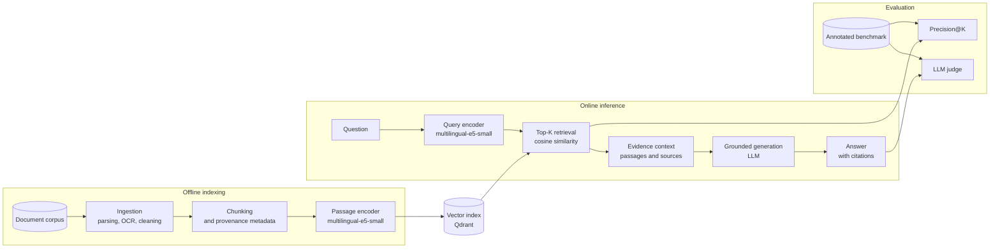
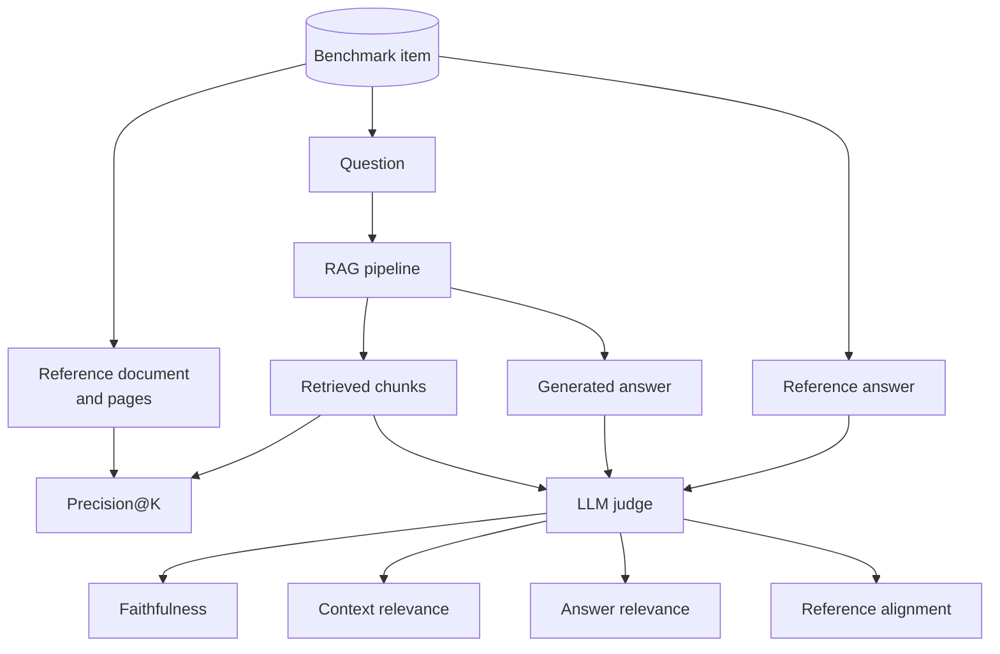

# Multimodal GenAI Decision Support

**Evidence-grounded decision support for digital transformation and AI governance using Retrieval-Augmented Generation**

## Abstract

This repository contains a research prototype of a Retrieval-Augmented Generation (RAG) system for decision support in digital transformation and AI governance. Organizational documents are converted into retrievable passages; for a given question, the most relevant passages are retrieved and a language model is instructed to answer from this evidence only, citing the source document and page. Ingestion, retrieval, generation and evaluation are kept separate so that each stage can be measured independently.

The system is not yet multimodal in the machine-learning sense: all formats are reduced to text, tables are serialized and images are processed by OCR. Visual and layout understanding are part of the research agenda.

## Research question

How can Retrieval-Augmented Generation transform organizational document knowledge into traceable, evidence-grounded decision support for digital transformation and AI governance?

The prototype addresses three requirements: **retrievability** of relevant passages, **grounding** of generated claims in retrieved evidence, and **traceability** of evidence to its document and page.

## Project status

### Completed and validated on real documents

- [x] PDF ingestion with page-level provenance (corpus of 5 documents, 284 pages, English and French)
- [x] Text cleaning, encoding correction and sentence-aware chunking
- [x] Indexing of a document collection in Qdrant
- [x] Multilingual dense retrieval (`intfloat/multilingual-e5-small`), optionally restricted to one document
- [x] Grounded generation with a local open-weight model (`llama3.2:3b`, Ollama)
- [x] Retrieval evaluation (Precision@K on document and page) and LLM-assisted answer evaluation
- [x] Complete 10-question baseline run and embedding-model comparison

### Implemented, partially validated

| Component | Validated on | Not yet validated on |
|---|---|---|
| DOCX, PPTX, XLSX, CSV, HTML, Markdown and TXT ingestion | synthetic files | real documents |
| OCR (images, scanned PDF pages) | one image, one PDF page without text layer | scanned documents |
| Hugging Face and Gemini as LLM providers | mock server; Gemini before refactoring | current code against the real APIs |
| Full RAG evaluation on the 5-document corpus | retrieval stage | generation and judge stages |

### Planned

- [ ] Multi-document evaluation set and a larger benchmark
- [ ] Recall@K and MRR; a judge model distinct from the generator; human evaluation
- [ ] Hybrid lexical and dense retrieval, reranking
- [ ] Abstention when evidence is insufficient, verifiable citations
- [ ] Table, figure and layout understanding; visual embeddings
- [ ] Automated tests, user interface and deployment

## Architecture

The system comprises an offline indexing stage, an online inference stage and an evaluation stage. Passages and questions are encoded by the same multilingual bi-encoder, so that a French question can be matched with an English passage.


```mermaid
flowchart LR
    subgraph OFF["Offline indexing"]
        DOC[("Document corpus")] --> ING["Ingestion<br/>parsing, OCR, cleaning"]
        ING --> CHK["Chunking<br/>and provenance metadata"]
        CHK --> PE["Passage encoder<br/>multilingual-e5-small"]
    end

    PE --> IDX[("Vector index<br/>Qdrant")]

    subgraph ON["Online inference"]
        Q["Question"] --> QE["Query encoder<br/>multilingual-e5-small"]
        QE --> RET["Top-K retrieval<br/>cosine similarity"]
        RET --> CTX["Evidence context<br/>passages and sources"]
        CTX --> GEN["Grounded generation<br/>LLM"]
        GEN --> ANS["Answer<br/>with citations"]
    end

    IDX --> RET

    subgraph EVAL["Evaluation"]
        BEN[("Annotated benchmark")] --> PK["Precision@K"]
        BEN --> JDG["LLM judge"]
    end

    RET --> PK
    ANS --> JDG
```

Each format is mapped to a citable unit that is propagated to chunks, retrieval results and citations:

| Format | Unit |
|---|---|
| PDF, HTML, TXT, images | page |
| PPTX | slide |
| XLSX, CSV | sheet |
| DOCX, Markdown | section |

## Methodology

**Ingestion.** PDF text is extracted page by page; pages without a text layer are processed with Tesseract OCR. Table rows are serialized as `header: value` pairs. Repeated headers and footers are removed from paginated formats, and corpus-specific encoding errors are corrected.

**Chunking.** Text is split into chunks of about 1000 characters with a 200-character overlap, at paragraph and sentence boundaries. Each chunk keeps its document and unit.

**Retrieval.** Chunks and questions are encoded with `intfloat/multilingual-e5-small` (384 dimensions, 512-token inputs, `passage:` and `query:` prefixes). Qdrant returns the five most similar chunks by cosine similarity.

**Generation.** Retrieved chunks are inserted into the prompt with their sources. The model is instructed to answer from this context only, to state when it is insufficient, and to cite the document and unit of each claim. This constraint is enforced at prompt level and does not guarantee faithfulness. Generation uses temperature 0 and a fixed seed.

## Evaluation protocol


```mermaid
flowchart TB
    ITEM[("Benchmark item")]
    ITEM --> REF["Reference document<br/>and pages"]
    ITEM --> Q["Question"]
    ITEM --> RA["Reference answer"]

    Q --> RAG["RAG pipeline"]
    RAG --> RC["Retrieved chunks"]
    RAG --> GA["Generated answer"]

    REF --> P["Precision@K"]
    RC --> P

    RC --> J["LLM judge"]
    GA --> J
    RA --> J

    J --> F["Faithfulness"]
    J --> CR["Context relevance"]
    J --> AR["Answer relevance"]
    J --> AL["Reference alignment"]
```

The benchmark contains 10 questions in French, annotated with reference pages in the English document `GovInst-AI-Whitepaper.pdf`, and a reference answer. A retrieved chunk is counted as relevant when both its document and its page match the annotation:

$$
\mathrm{Precision@K} = \frac{\left|\{\text{retrieved chunks from the reference document and pages}\}\right|}{K}
$$

Retrieval is evaluated in two scopes: **reference document**, where the search is restricted to the annotated document and results are comparable with the single-document baseline, and **corpus**, where all indexed documents are searched. Judge scores lie in [0, 1] and are treated as indicators; they have not been validated against human judgments.

## Results

All experiments use the 10-question benchmark, K = 5, and the chunking parameters above.

### Single-document baseline

Corpus restricted to `GovInst-AI-Whitepaper.pdf` (39 pages, 114 chunks), embeddings `all-MiniLM-L6-v2`, generation and judge `llama3.2:3b`.

| Metric | Mean |
|---|---:|
| Precision@5 | 0.200 |
| Faithfulness | 0.760 |
| Context relevance | 0.940 |
| Answer relevance | 0.610 |
| Reference alignment | 0.560 |

Retrieval is the weakest stage. The judge shows low discrimination (faithfulness of 0.8 on nine questions out of ten), which is consistent with a small model evaluating its own outputs.

### Effect of multilingual embeddings

Reference-document scope.

| Embedding model | Precision@5 | Questions with at least one relevant chunk |
|---|---:|---:|
| `all-MiniLM-L6-v2` (English) | 0.200 | 8 / 10 |
| `intfloat/multilingual-e5-small` | 0.280 | 9 / 10 |

Since the questions are in French and the document in English, a multilingual encoder improves Precision@5 by 40 % relative.

### Effect of corpus expansion

Four French reports on the same topics were added (Commission de l'IA 2024, OECD 2025, CSNP 2026, CIGREF 2025), giving 5 documents, 284 pages and 1109 chunks. In the corpus scope, Precision@5 is 0.000 with both encoders, and none of the 50 retrieved chunks comes from the annotated document.

The retrieved chunks are nevertheless topically relevant to the questions. The result therefore exposes a limitation of the benchmark, which recognizes a single relevant document per question, rather than a retrieval failure. A residual language bias is also observed: French passages obtain higher similarity scores (about 0.88) than the relevant English passages (about 0.85).

## Limitations

1. All content is reduced to text; visual and layout information is not exploited.
2. Relevance annotations cover a single document and may omit relevant pages.
3. Ten questions do not support statistically robust conclusions.
4. The LLM judge is not validated and, in the reported runs, evaluates its own outputs.
5. A 3-billion-parameter model limits answer quality.
6. Retrieval is dense only, without lexical search or reranking.

## Installation

Requirements: Python 3.11, Docker, [Ollama](https://ollama.com), and Tesseract for OCR.

```bash
git clone https://github.com/soumailaniampa11/multimodal-genai-decision-support.git
cd multimodal-genai-decision-support
python3.11 -m venv .venv && source .venv/bin/activate
pip install -r requirements.txt

ollama pull llama3.2:3b
docker compose up -d
```

For OCR, install Tesseract (`brew install tesseract`) and the French language data (`fra.traineddata`). To use Hugging Face or Gemini instead of the local model, set the provider in `config/config.yaml` and define `HF_TOKEN` or `GEMINI_API_KEY` in a `.env` file.

## Usage

```bash
python -m tests.test_qdrant                 # index all documents in data/raw
python -m tests.test_retrieval_benchmark    # retrieval evaluation, both scopes
python -m tests.test_rag                    # full RAG evaluation
```

All parameters (chunking, embedding model, K, evaluation scope, LLM provider and models) are defined in `config/config.yaml`. The index must be rebuilt after changing the documents, the embedding model or the chunking parameters.

## Repository structure

```text
config/config.yaml              experimental parameters
data/evaluation/                benchmark (10 annotated questions)
data/raw/                       source documents, not versioned
src/ingestion/                  multi-format loading and OCR
src/cleaning/                   text cleaning and encoding correction
src/chunking/                   sentence-aware chunking
src/metadata/                   provenance metadata
src/embeddings/                 multilingual encoder
src/retrieval/                  Qdrant storage and search
src/llm/                        Ollama, Hugging Face and Gemini clients
src/generation/                 grounded answer generation
src/evaluation/                 retrieval metrics and LLM judge
tests/                          experiment scripts (run manually)
```

## License

Intended for research and educational use. A specific open-source license has not yet been selected.
