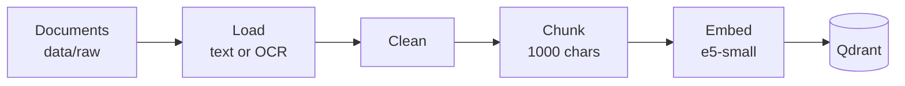
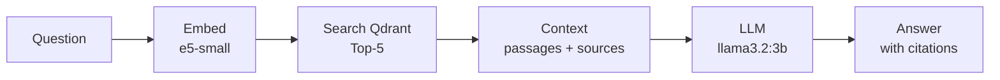
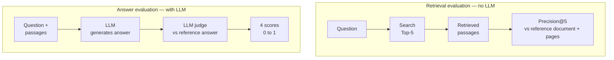

# Multimodal GenAI Decision Support

## Evidence-Grounded Decision Support for Digital Transformation and AI Governance

<p align="center">
<strong>document ingestion · OCR · chunking · multilingual retrieval · local LLM · RAG · provenance · evaluation</strong>
</p>

---

## Abstract

This repository contains a research prototype for **evidence-grounded decision support with Retrieval-Augmented Generation (RAG)** in the context of digital transformation and AI governance.

The prototype turns organizational documents into retrievable passages, retrieves the passages relevant to a question, and asks a language model to answer **only from those passages**, citing the document and page. Each stage — ingestion, retrieval, generation and evaluation — is kept separate so that its quality and failure modes can be studied on their own.

The research emphasis is not on building a generic chatbot but on measuring retrieval quality, grounding and traceability.

> **Implementation boundary.** Despite the repository name, the system is **not multimodal in the machine-learning sense**. Every format is reduced to text: tables become lines of text and images are read with OCR. Understanding of figures, layout and visual content is future work.

---

## 1. Project Status

This section states plainly what exists today and what does not.

### ✅ Done and tested on real documents

- [x] PDF ingestion, page by page, on a corpus of 5 real PDFs (284 pages, English and French)
- [x] Text cleaning (repeated headers/footers, whitespace) and encoding correction
- [x] Sentence-aware chunking (1000 characters, 200 overlap), keeping the source page
- [x] Provenance metadata for every chunk (document, page, chunk)
- [x] Indexing of a whole folder into Qdrant, with unique identifiers across documents
- [x] Multilingual embeddings (`intfloat/multilingual-e5-small`) — a French question can retrieve an English passage
- [x] Dense retrieval (cosine similarity, Top-5), optionally restricted to one document
- [x] Answer generation with a **local** open-weight model (`llama3.2:3b` through Ollama), free and without quota
- [x] Retrieval evaluation: Precision@5 matching both document **and** page, in two scopes
- [x] LLM-assisted answer evaluation (faithfulness, context relevance, answer relevance, reference alignment)
- [x] One complete 10-question RAG evaluation run (single-document baseline, Section 8.1)
- [x] Retrieval-only benchmark comparing two embedding models (Sections 8.2 and 8.3)
- [x] Central configuration (`config/config.yaml`), pinned dependencies, pinned Qdrant version

### 🟡 Implemented, only partially tested

| Feature | What has been verified | What has not |
|---|---|---|
| DOCX, PPTX, XLSX, CSV, HTML, Markdown, TXT ingestion | small synthetic files of each format | real-world documents of these formats |
| OCR for images and scanned PDF pages (English + French) | one synthetic image; one real PDF page without text layer (a cover with logos) | a genuinely scanned document; OCR quality on real scans |
| Hugging Face Inference Providers as LLM | request format, against a local mock server | the real API |
| Google Gemini as LLM | used for one question before the code was refactored | the refactored client against the real API |
| Full RAG evaluation with multilingual embeddings on the 5-document corpus | retrieval part only | generation and LLM-judge part |

### ⬜ Not done yet

**Evaluation**
- [ ] Multi-document evaluation set (several accepted documents per question)
- [ ] More than 10 questions
- [ ] Recall@K, Hit Rate@K, MRR
- [ ] A judge model different from the generation model
- [ ] Human evaluation of a subset of answers
- [ ] Saving each run's configuration and results to a file

**Retrieval**
- [ ] Hybrid retrieval (keyword BM25 + dense)
- [ ] Reranking
- [ ] Mitigation of the language bias observed in Section 8.3

**Generation**
- [ ] Structured, verifiable citations
- [ ] Abstention when the evidence is insufficient
- [ ] Larger local models (7–8B) once bandwidth allows

**Multimodal**
- [ ] Native table extraction and reasoning
- [ ] Understanding of figures and diagrams
- [ ] Layout modeling
- [ ] Visual embeddings and cross-modal retrieval
- [ ] Legacy formats (`.doc`, `.ppt`, `.xls`) and OpenDocument

**Engineering**
- [ ] Automated tests (the scripts in `tests/` are run manually and contain no assertions)
- [ ] Continuous integration
- [ ] User interface (Streamlit or Gradio) and API
- [ ] Online deployment

---

## 2. Research Problem

Organizations increasingly rely on strategic, regulatory, technical, and managerial documents when making decisions about digital transformation and AI. Generative models produce fluent answers, but fluency alone does not show that an answer is supported by organizational evidence.

The prototype focuses on three requirements:

- **retrievability** — relevant passages should be found in a document collection;
- **grounding** — generated claims should be constrained by retrieved evidence;
- **traceability** — evidence should keep its document and page of origin.

### Research question

> **How can Retrieval-Augmented Generation transform organizational document knowledge into traceable, evidence-grounded decision support for digital transformation and AI governance?**

The current implementation is an experimental baseline for investigating this question, not a conclusive answer to it.

---

## 3. System Architecture

The system has three independent stages. Each is shown as a straight pipeline.

### 3.1 Indexing (offline, run once per corpus)


```mermaid
flowchart LR
    A["Documents<br/>data/raw"] --> B["Load<br/>text or OCR"] --> C["Clean"] --> D["Chunk<br/>1000 chars"] --> E["Embed<br/>e5-small"] --> F[("Qdrant")]
```

### 3.2 Question answering (online, per question)


```mermaid
flowchart LR
    A["Question"] --> B["Embed<br/>e5-small"] --> C["Search Qdrant<br/>Top-5"] --> D["Context<br/>passages + sources"] --> E["LLM<br/>llama3.2:3b"] --> F["Answer<br/>with citations"]
```

The question is also given to the LLM together with the context.

### 3.3 Evaluation (offline, on the evaluation set)


```mermaid
flowchart TB
    subgraph R["Retrieval evaluation — no LLM"]
        direction LR
        R1["Question"] --> R2["Search<br/>Top-5"] --> R3["Retrieved<br/>passages"] --> R4["Precision@5<br/>vs reference document + pages"]
    end
    subgraph G["Answer evaluation — with LLM"]
        direction LR
        G1["Question +<br/>passages"] --> G2["LLM<br/>generates answer"] --> G3["LLM judge<br/>vs reference answer"] --> G4["4 scores<br/>0 to 1"]
    end
```

Evaluation never influences the answer returned to the user.

### Architectural principle

The same embedding model encodes passages and questions, so both live in the same 384-dimensional space. Because the model is multilingual, a French question can be matched with an English passage. Retrieved passages and their sources are the only evidence given to the language model.

---

## 4. Repository Structure

```text
multimodal-genai-decision-support/
├── config/
│   └── config.yaml             # all experimental parameters
├── data/
│   ├── raw/                    # source documents; excluded from Git
│   ├── processed/              # derived artifacts; excluded from Git
│   └── evaluation/
│       └── rag_questions.json  # 10 annotated questions
├── src/
│   ├── config.py               # configuration loader
│   ├── ingestion/
│   │   └── document_loader.py  # all formats + OCR
│   ├── cleaning/
│   │   ├── pdf_cleaner.py
│   │   └── encoding_corrector.py
│   ├── chunking/
│   │   └── pdf_chunker.py
│   ├── metadata/
│   │   └── metadata_builder.py
│   ├── embeddings/
│   │   └── embedding_model.py
│   ├── retrieval/
│   │   └── qdrant_store.py
│   ├── llm/
│   │   └── llm_client.py       # Ollama, Hugging Face and Gemini clients
│   ├── generation/
│   │   └── llm_generator.py
│   └── evaluation/
│       ├── retrieval_evaluator.py
│       └── llm_evaluator.py
├── tests/                      # manual scripts, run with python -m
│   ├── test_qdrant.py              # index every document in data/raw
│   ├── test_retrieval_benchmark.py # retrieval-only evaluation
│   ├── test_rag.py                 # full RAG evaluation
│   └── ...                         # one script per component
├── requirements.txt
├── docker-compose.yml          # Qdrant
└── README.md
```

---

## 5. Technology Stack

| Component | Technology |
|---|---|
| Language | Python 3.11 |
| PDF | `pypdf`; `PyMuPDF` to render pages for OCR |
| Office and web formats | `python-docx`, `python-pptx`, `openpyxl`, `pandas`, `lxml` |
| OCR | Tesseract (`pytesseract`), English + French |
| Embeddings | `sentence-transformers`, `intfloat/multilingual-e5-small` (384 dimensions) |
| Vector database | Qdrant `v1.19.1` (Docker), cosine similarity |
| Language model | `llama3.2:3b` through Ollama (local) |
| Optional LLM providers | Hugging Face Inference Providers, Google Gemini |
| Configuration | `config/config.yaml`; `.env` for optional API keys |

All Python dependencies are pinned in `requirements.txt`.

---

## 6. Methodology

### 6.1 Ingestion and citable units

`DocumentLoader` converts every supported format into the same structure: a list of **units** with their text. The unit is what answers cite.

| Format | Extraction | Unit |
|---|---|---|
| PDF | text layer; OCR when a page has none | page |
| DOCX | paragraphs and tables, in order | section (new one at each heading) |
| PPTX | text, tables, speaker notes | slide |
| XLSX / CSV | rows of each sheet | sheet |
| HTML | visible text | page |
| Markdown | split at headings | section |
| TXT | full text | page |
| Images | OCR | page |

Table rows are written as `header: value | header: value` so that each value keeps its meaning. This is a textual approximation, not table reasoning.

### 6.2 Cleaning

`PDFTextCleaner` removes lines repeated at the top or bottom of several pages (running headers and footers) and normalizes whitespace. This detection is applied only to paginated formats (PDF, PPTX), and a line must appear on at least two pages to be removed. `encoding_corrector.py` fixes character-encoding errors observed in the corpus; it is corpus-specific, not a general repair method.

### 6.3 Chunking

Text is split unit by unit into chunks of about 1000 characters with 200 characters of overlap, cutting at paragraph and sentence boundaries. Each chunk keeps its source unit. This is **sentence-aware**, not semantic, chunking.

### 6.4 Provenance metadata

```json
{
  "chunk_id": "chunk_0107",
  "document_id": "GovInst-AI-Whitepaper.pdf",
  "file_type": "pdf",
  "unit": "page",
  "page": 36,
  "chunk_index": 107,
  "text": "..."
}
```

`page` holds the unit number and `unit` says whether it is a page, slide, sheet or section. Qdrant identifiers are derived from the document and chunk identifiers, so several documents never overwrite each other.

### 6.5 Embeddings and retrieval

Chunks and questions are encoded with `intfloat/multilingual-e5-small` (about 100 languages, inputs up to 512 tokens). As the model requires, passages are prefixed with `passage: ` and questions with `query: `. The English-only `all-MiniLM-L6-v2`, limited to 256 tokens, is kept as the documented baseline.

Qdrant returns the 5 most similar chunks by cosine similarity. A search can be restricted to one document, which the evaluation uses to compare with the single-document baseline.

### 6.6 Generation

The retrieved chunks are written into the prompt with their document and unit. The model is instructed to answer only from this context, to say when the context is insufficient, and to cite the document and unit of each claim. This is a **prompt-level** constraint: it reduces but does not guarantee unsupported claims.

The LLM provider is chosen in `config/config.yaml`:

| Provider | Where the model runs | Requirement | Tested |
|---|---|---|---|
| `ollama` (default) | locally | Ollama + model pulled | ✅ real runs |
| `huggingface` | Hugging Face servers | `HF_TOKEN` in `.env` | 🟡 mock server only |
| `gemini` | Google servers | `GEMINI_API_KEY` in `.env` | 🟡 before refactoring only |

Local generation uses temperature 0, a fixed seed and an 8192-token context, so runs are reproducible.

---

## 7. Evaluation Framework

### 7.1 Evaluation set

`data/evaluation/rag_questions.json` contains **10 questions in French**, annotated on the English document `GovInst-AI-Whitepaper.pdf`:

```json
{
  "id": "q001",
  "question": "...",
  "relevant_document": "GovInst-AI-Whitepaper.pdf",
  "relevant_pages": [16, 35, 36],
  "reference_answer": "..."
}
```

The pages are a manual annotation, not an exhaustive ground truth: relevant passages may exist on other pages or in other documents.

### 7.2 Retrieval metric

$$
\mathrm{Precision@K} = \frac{\text{retrieved chunks from the reference document and pages}}{K}
$$

Both the document and the page must match; matching pages alone would wrongly accept page 16 of any document.

| Scope | Search space | Purpose |
|---|---|---|
| `reference_document` | the annotated document only | comparable with the single-document baseline |
| `corpus` | all indexed documents | real use case |

### 7.3 Answer evaluation

An LLM judge scores each answer from 0 to 1 on four dimensions:

| Dimension | Question asked to the judge |
|---|---|
| Faithfulness | Are the answer's claims supported by the retrieved passages? |
| Context relevance | Are the retrieved passages useful for the question? |
| Answer relevance | Does the answer address the question? |
| Reference alignment | Does the answer cover the reference answer? |

These scores are **indicators**, not validated measurements. They have not been compared with human judgments.

---

## 8. Experimental Results

All runs: 10 questions, Top-5, chunks of 1000 characters with 200 overlap, deterministic decoding.

### 8.1 Single-document baseline (full RAG run)

Corpus: `GovInst-AI-Whitepaper.pdf` only (39 pages, 114 chunks) · embeddings: `all-MiniLM-L6-v2` · generation and judge: `llama3.2:3b`.

| Indicator | Mean |
|---|---:|
| Precision@5 | 0.200 |
| Faithfulness | 0.760 |
| Context relevance | 0.940 |
| Answer relevance | 0.610 |
| Reference alignment | 0.560 |

**Observations**

1. Retrieval is the weakest stage: on average one retrieved chunk in five comes from an annotated page, and two questions retrieve none.
2. The judge barely discriminates: faithfulness is 0.8 for nine questions out of ten, context relevance is 0.9 or 1.0 everywhere — consistent with a small model judging its own answers.
3. The questions are in French, the document in English, and the embedding model is English-only.

An earlier attempt with Gemini stopped after one question because of free-tier quota limits; the local model removed this constraint.

### 8.2 Multilingual embeddings (retrieval only)

Same document, scope `reference_document`.

| Embedding model | Precision@5 | Questions with at least one correct chunk |
|---|---:|---:|
| `all-MiniLM-L6-v2` (English-only) | 0.200 | 8 / 10 |
| `intfloat/multilingual-e5-small` | **0.280** | 9 / 10 |

The multilingual model improves Precision@5 by 0.08 (40 % relative).

### 8.3 Five-document corpus (retrieval only)

Four French documents on the same topics were added:

| Document | Language | Pages | Chunks |
|---|---|---:|---:|
| GovInst — AI Governance White Paper | EN | 39 | 114 |
| Commission de l'IA — *IA : notre ambition pour la France* (2024) | FR | 130 | 519 |
| OCDE — *L'adoption de l'IA par les PME* (2025) | FR | 68 | 297 |
| CSNP — *Avis sur l'adoption de l'IA par les entreprises* (2026) | FR | 30 | 129 |
| CIGREF — *Guide de mise en œuvre de l'AI Act : Gouvernance* (2025) | FR | 17 | 50 |
| **Total** | | **284** | **1109** |

| Embedding model | Precision@5 (scope `corpus`) | Chunks from the annotated document |
|---|---:|---:|
| `all-MiniLM-L6-v2` | 0.000 | 0 / 50 |
| `intfloat/multilingual-e5-small` | 0.000 | 0 / 50 |

**Interpretation.** With both models, none of the 50 retrieved chunks comes from the annotated English document. The chunks retrieved instead (for example the Commission report on levers for mastering AI, or the OECD recommendations for SMEs) are topically relevant to the generic questions of the dataset.

The zero score therefore mainly shows a **limit of the evaluation set**: it accepts a single document, while the corpus now contains several that legitimately answer the same questions. A **language bias** also remains: the best French chunks score about 0.88 and the best annotated English chunks about 0.85, so French passages always come first.

---

## 9. Reproducibility

| Component | Setting |
|---|---|
| Chunking | sentence-aware, 1000 characters, 200 overlap |
| Embedding model | `intfloat/multilingual-e5-small` (baseline: `all-MiniLM-L6-v2`) |
| Vector store | Qdrant `v1.19.1`, cosine |
| Retrieval depth | Top-5 |
| Generation and judge | `llama3.2:3b` (Ollama), temperature 0, seed 42 |
| Retrieval metric | Precision@5, document + page |
| Evaluation set | 10 questions |

All parameters live in `config/config.yaml` and dependencies are pinned. Results are not yet saved automatically per run (see Section 1).

---

## 10. Installation and Execution

### Prerequisites

Python 3.11, Docker, Git, [Ollama](https://ollama.com), and Tesseract (only for images and scanned PDFs).

### Setup

```bash
git clone https://github.com/soumailaniampa11/multimodal-genai-decision-support.git
cd multimodal-genai-decision-support

python3.11 -m venv .venv
source .venv/bin/activate
pip install -r requirements.txt
```

### Local language model

```bash
brew install ollama
brew services start ollama
ollama pull llama3.2:3b
```

### OCR (optional)

```bash
brew install tesseract
curl -L -o "$(brew --prefix)/share/tessdata/fra.traineddata" https://github.com/tesseract-ocr/tessdata_fast/raw/main/fra.traineddata
```

Tesseract ships with English only; the second command adds French (about 1 MB).

### Optional API providers

Set the provider in `config/config.yaml` and add the key to a `.env` file (never committed):

```env
HF_TOKEN=your_hugging_face_token
GEMINI_API_KEY=your_gemini_api_key
```

### Run

```bash
docker compose up -d                          # start Qdrant
python -m tests.test_qdrant                   # index every document in data/raw
python -m tests.test_retrieval_benchmark      # retrieval only, a few seconds
python -m tests.test_rag                      # full RAG evaluation, several minutes
```

Re-run the indexing whenever documents, the embedding model or the chunking parameters change.

---

## 11. Configuration

| Section of `config/config.yaml` | Content |
|---|---|
| `data` | document folder, evaluation file |
| `ingestion` | OCR languages |
| `chunking` | chunk size and overlap |
| `embeddings` | model, query and passage prefixes |
| `qdrant` | host, port, collection |
| `retrieval` | Top-K, evaluation scope |
| `generation`, `evaluation` | LLM provider and model for each role |
| `ollama`, `huggingface` | provider settings |

---

## 12. Next Steps

In order of priority (details in Section 1):

1. **Multi-document evaluation set** — without it, results on the full corpus cannot be measured.
2. **Full RAG run** with multilingual embeddings on the 5-document corpus.
3. **Separate judge model** and **Recall@K / MRR**.
4. **Hybrid retrieval and reranking**, measured against the current baseline.
5. **Interface and deployment** for demonstration.
6. **Multimodal extensions** (tables, figures, layout), compared against the textual baseline.

---

## 13. Limitations

1. **Text only** — visual and layout information is not used.
2. **Single-document annotations** — the evaluation set underestimates retrieval quality on the multi-document corpus.
3. **Small evaluation set** — 10 questions do not support statistically robust conclusions.
4. **Unvalidated LLM judge** — no comparison with human judgments; the same small model generates and judges.
5. **Small local model** — 3 billion parameters limit answer quality.
6. **Dense retrieval only** — no keyword search, no reranking.
7. **Corpus-specific encoding correction** — may not generalize.
8. **No decision-outcome evaluation** — answers are evaluated, not the decisions made from them.

---

## 14. Scientific Positioning

The project lies at the intersection of Retrieval-Augmented Generation, information retrieval, document processing, decision support systems, digital transformation and AI governance. Its scientific interest is the **traceable transformation of organizational documents into retrieved evidence and evidence-constrained answers**, with explicit evaluation of each stage.

It should be understood as an **experimental RAG system for decision-support research**, not as evidence that RAG alone produces trustworthy organizational decisions. Trustworthiness also requires stronger evaluation, human oversight and governance mechanisms.

---

## 15. Conclusion

The repository provides a modular, local and reproducible RAG baseline over organizational documents. The first experiments show a measurable gain from multilingual embeddings (Precision@5 from 0.20 to 0.28 on the reference document) and reveal that single-document relevance annotations no longer hold once the corpus contains several documents on the same topic. The next step is a multi-document evaluation protocol, before adding more advanced retrieval or multimodal understanding.

---

## 16. License

This repository is intended for research and educational use. A specific open-source license should be chosen before broader redistribution.
